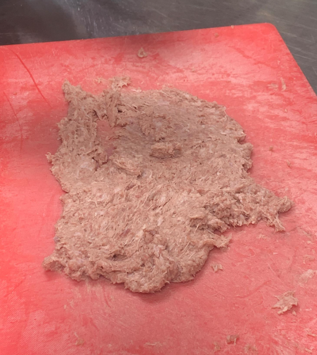
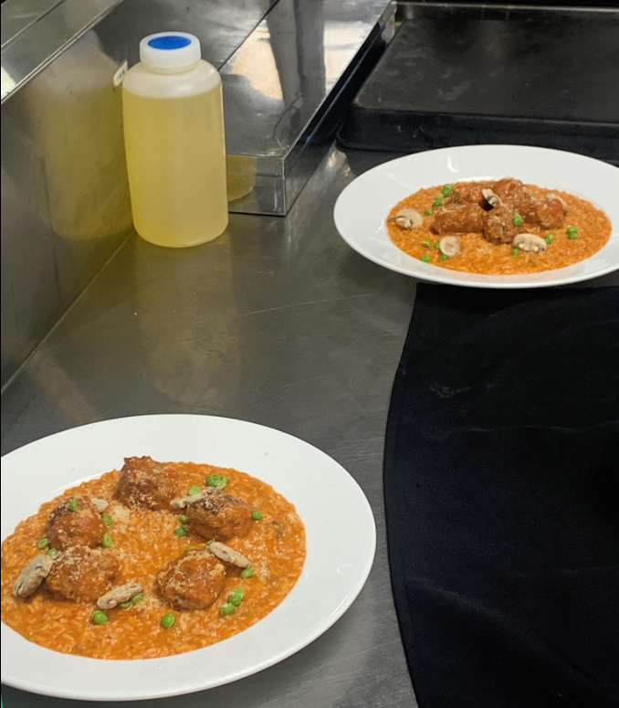

- [[632_Cook_Recipe]] 
第五堂課20220702鄉村南瓜濃湯 尼耍斯沙拉 牛肉丸茄汁燉飯

- | **菜單名稱** | **尼耍斯沙拉** | **菜單名稱** | **乡村南瓜浓汤** | **菜單名稱** | **奶油野菇炖饭 ** |
  |---|---|---|---|---|---|
  | 四季豆 | 60g | 东昇南瓜 | 500g | 泰国米 | 1cup  |
  | 马铃薯条 | 1ea | 红萝菠 | 100g | 鸡高汤 | 1.25cup  |
  | 牛蕃茄 | 1ea | 洋葱 | 1/2ea | 蒜碎 | 1/2t  |
  | 鸡蛋 | 2ea | 西芹 | 80g | 蘑菇片 | 30g  |
  | 美生菜 | 80g | 培根 | 2ea | 青豆仁 | 30g  |
  | 黑橄榄 | 4ea | 月桂叶 | 2ea | 奶油 | 20g  |
  | 鯷鱼 | 少许 | 奶油 | 100g | 月桂叶 | 1ea  |
  | 鲔鱼 | 1/3罐 | 高汤 | 1000cc | 起司粉 | 1T  |
  | 酸豆 | 少许 | s/p | 适量 |  |   |
  |  |  | 糖 | 适量 |  |   |
  |  |  | 面包丁 | 适量 |  |   |
  | 油醋汁 | 3比1 | 鲜奶油 | 60cc |  |   |
  | 橄榄油 |  |  |  |  |   |
  | 白酒醋 |  |  |  |  |   |
  | 蒜碎 | 1t |  |  |  |   |
  | 糖 | 1t |  |  |  |   |
  | s/p | 适量 |  |  |  |   |
-
- 
制作南瓜汤

  挑选南瓜非常重要，東昇南瓜皮更薄，比栗子南瓜更香(南瓜子不要丟掉，可以拿來烤或者煮基礎高湯都可，很生的南瓜不要煮南瓜湯色跟味都會不好，判斷方法，南瓜蒂頭出現糖蜜的有香味的就對了，另外不建議買胡蘆型的)南瓜屬於蔬菜類的不是澱粉質食物，南瓜切大塊，各大块上面放一塊奶油鋁箔紙包起來175度烤三十分鐘，考到一汤匙戳到底，并且表面微微焦
  南瓜湯好吃，处理南瓜要包鋁箔紙烤熟或者炒熟，不要用蒸的
  
  半片吐司切丁做濃湯吐司丁
  南瓜汤洋蔥逆紋切片
  紅蘿蔔切丁，蒂頭不要熬湯通常有藏沙子
  芹菜尾切丁，也容易藏沙
  60cc鮮奶油下面隔着冰水打發，當南瓜湯的裝飾
  
  开始炒料，培根切粗絲，熱鍋下兩大茶匙沙拉油炒培根，炒到恰恰(有点耐心)，用濾網濾油，放纸巾吸油备用拿培根油炒洋蔥，但是不要炒上色，只要软香就好
  
  同时可用锅子开始煮南瓜汤，冷鍋下30克奶油，奶油融化，火要小，炒紅蘿蔔，慢慢表皮熟的時候，都持續要小火。（如果怕麻煩時間太多，隨便生的丟進去直接煮湯一定很難吃）紅蘿蔔熟透叉子可以戳過就是透了，下上一步炒完的洋蔥培根油拌炒，也軟以後加入芹菜，月桂葉和前面旁邊用蔬菜餘料煮的蔬菜高湯（500cc的水煮各種蔬菜），烤好了的南瓜很香，就全部丟下去湯裡面，適度補高湯淹過食材兩公分，煮滾開始算小火煮30分鐘，稍微冷卻果汁機打5分鐘，濾網過濾，重新加熱開始調味，加鹽，補一點糖（老師版本不加雞精粉）(這狀態可以冷凍保存，蒸来喝的时候不用另外加水)，出菜前加入60CC鮮奶油到浓汤中搅匀，即可放上培根丝裝盤
-
- 
制作尼耍斯沙拉

  四季豆去头去尾，切五公分斜刀切，下去燙滾水加鹽数30秒，起来可泡冰水
  生菜拨好泡冰水
  馬鈴薯最好撥的狀態就是熱撥，用刀子刮皮就下來了，以滚刀法切成女生一口大小(滾刀法就是切成長條形，以後以東斜一刀西斜一刀的方式)
  水煮蛋，加醋跟鹽，水滾後下煮七分鐘，起來泡冰水，起來十字對切
  番茄切八瓣，也可以用小番茄
  鯷魚可以用薄鹽腥鯖魚代替，烤過再放上去
  橄榄切圆片
  
  製作油醋醬，油比醋三比一的比例，鹽巴1/4小茶匙，白黑胡椒跟糖都加一點點可能1/8小茶匙，先加30cc醋再加90cc橄欖油，用打蛋器打一打會稠融合在一起，可以试味道
  擺盤，放生菜葉捏一捏比較堆疊，番茄，馬鈴薯，水煮蛋，斷生的四季豆
-
- 
制作牛肉丸

  半片土司切丁泡90cc牛奶，加新鮮吐司風味比加麵包粉好
  九層塔大概1/2小茶匙，可以手捲一捲切絲然後剁碎
  牛猪比3:1，牛豬絞肉抓均勻，用兩把中式菜刀採人字形將肉切縻，大概要剁15分鐘，有點黏稠感
  
  開始准备塑型成肉丸，1/8小茶匙鹽加到肉糜裡可以生筋性（盐比肉大概1:100），下面放冰水隔水冰鎮，要一路砸出筋性才行，大概5分鐘差不多完成就可以離開冰水，加牛奶吐司、蒜碎、九層塔碎，1/4小茶匙奧立綱（五香粉台式也可以），黑胡椒，白胡椒都加一點點，一大茶匙起司粉，再捏一捏，加一大茶匙左右的蛋白汁液，肉團弄均勻，盤子跟手沾油，用湯匙一球球擠出來，用雙手上下丟的方式把肉丸整成圓形，(这种丸子煮煎烤都适合)
  
  煎丸子，只是要煎定型，不是為了讓他熟，稍後會放到番茄糊中燉煮，熱鍋要夠熱，冷油下一大茶匙沙拉油，下肉丸，一開始不要搖太大力會散，推一下讓肉丸離鍋，表面上色
-
- 
制作炖饭

  
  蘑菇两三颗去掉根部，菇傘下緣往上撥上面傘面的皮，當生蘑菇裝飾，切厚片泡冰水减菌
  洋蔥半颗切洋蔥碎，做肉丸跟燉飯的材料
  蒜頭切成蒜碎
  青豆仁熟的剝皮，開水燙過後，拌鹽跟橄欖油
  泰國米洗完沥乾不要泡水，可能泡水不好控制炖饭时间(只有台灣人跟日本人在吃梗米，其他世界地方都是吃秈米(泰國米)
  
  番茄酱汁制作，一大茶匙的橄欖油，下洋蔥碎，炒香後下蒜碎、九層塔葉子，加一大茶匙的番茄糊，一小茶匙義大利綜合香料、60cc紅酒、360cc牛番茄打成泥的渣狀物、木匙搗碎後加240cc高湯，月桂葉一片，煮滾後大概15分鐘，收汁後果汁機打，熱打要注意不能蓋，打完會變橘紅色比原本的白一點點，回火上覆熱，下鹽跟白胡椒一點點調味完，肉丸子放進去，油也加進去，讓肉慢慢滾一下吃味道就可以關火泡著
  
  煮燉飯，下橄欖油，下洋蔥先炒，洋蔥透了，下蘑菇炒一下，下蒜頭，把米倒進來，下高湯大概跟米比例1:1，滾了以後關小火，十分鐘後打開大概會是乾鍋(但不应有锅巴)，這樣大概五六分熟而已，後續加240CC-360CC的番茄醬，加三大茶匙的起司粉，鹽巴黑胡椒白胡椒調味，加蛋黃，起鍋摆盘，可以下面拍盤子拍平，或者垫一块抹布，拿盘子撞桌子，平了後放上肉丸跟青豆跟生蘑菇（青豆蘑菇都拌橄欖油），再灑上起司粉
  
-
-
- 
额外知识点

  香腸大概包含四十趴的油，有够肥，但也因此好吃
  
  煮咖哩老師會先炸馬鈴薯上色与逼出香味，然後再用那個油炒透紅蘿蔔，再去炒雞肉半熟跟洋蔥炒上色，再下高湯滾了，再下前面炒的馬鈴薯跟紅蘿蔔，最後又滾了下咖哩塊。如果是咖哩粉就是炒洋蔥炒透以後下去拌炒
  漿湯類寧可濃不要太稀，煮的時候大概淹過食材兩公分就好，不要下太多水，如果用果汁機打的時候，漩渦的直徑兩公分大概就也是上桌的濃度
  
  用锅子煮白米的方式煮飯要1杯米配1.25杯水
  
  南瓜湯好吃，处理南瓜要包鋁箔紙烤熟或者炒熟，不要用蒸的