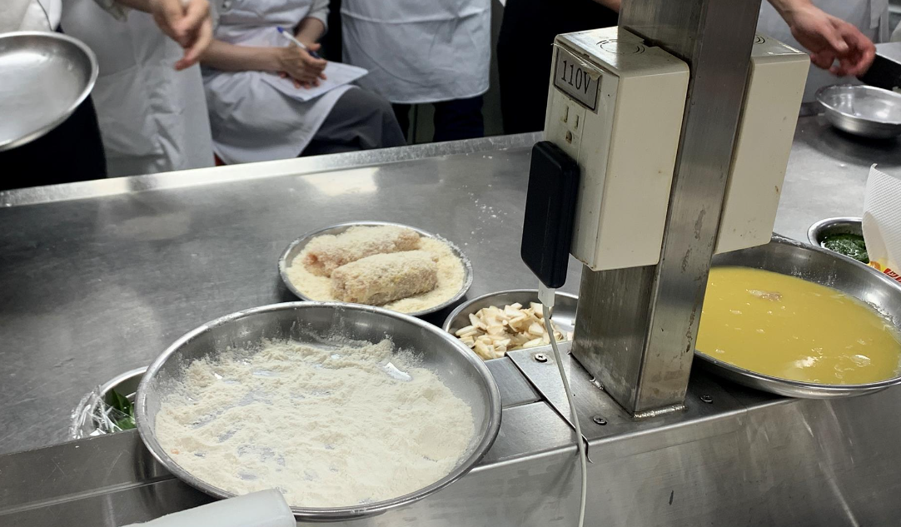
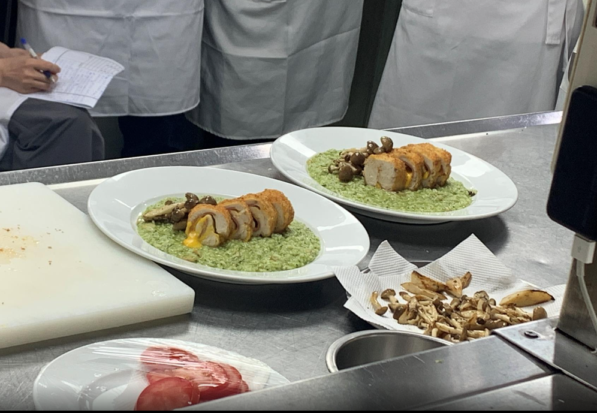
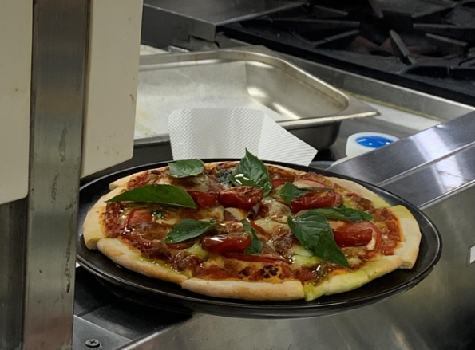

- [[632_Cook_Recipe]] 
第六堂課20220703義大利蔬菜湯，瑪格麗特披薩，起司雞肉青醬燉飯

- | **菜單名稱** | **义大利蔬菜汤** | **菜單名稱** | **煎炸起司鸡肉青酱炖饭** | **菜單名稱** | **青酱** | **菜單名稱** | **玛格丽特比萨 ** |
  |---|---|---|---|---|---|---|---|
  | 洋葱丁片 | 1/4ea | 泰国米 | 1cup | 九层塔叶 | 300g | 高筋面粉 | 200g  |
  | 西芹丁片 | 30g | 鸡高汤 | 1.25cup | 巴西利 | 120g | 低筋面粉 | 100g  |
  | 红萝菠丁片 | 30g | 蒜碎 | 1/2t | 蒜头 | 50g | 快速酵母 | 10g  |
  | 高丽菜丁片 | 30g | 洋葱碎 | 30g | 松子or蒜味花生 | 80g | 盐 | 4g  |
  | 牛蕃茄丁片 | 1ea | 鸿喜菇 | 30g | 橄榄油 | 200cc | 砂糖 | 10g  |
  | 馬鈴薯丁片 | 1/2ea | 奶油 | 20g |  |  | 橄榄油 | 30g  |
  | 蒜碎 | 1t | 月桂叶 | 1ea |  |  | 温水 | 170g  |
  | 培根 | 2ea | 起司粉 | 4T |  |  |  |   |
  | 奥立刚or义大利香料 | 1t | 白酒 | 60g |  |  | 牛蕃茄或蕃茄碎 | 2ea  |
  | 蕃茄糊 | 1T | 鸡胸肉 | 400g |  |  | 洋葱 | 1/2ea  |
  | 月桂叶 | 1ea | 圣女蕃茄 | 50g |  |  | 蒜头 | 30g  |
  | 通心粉 | 2T | 青酱 | 5T |  |  | 九层塔 | 10g  |
  | 高汤 | 3.5cup | s/p | 适量 |  |  | 白酒 | 30cc  |
  |  |  | 起司粉 | 适量 |  |  | 月桂叶 | 1ea  |
  |  |  | 鲜奶油 | 60cc=1/4cup |  |  | 义大利香料 | 1g  |
  |  |  | 面包粉 | 适量 |  |  |  |   |
  |  |  | 高筋面粉 | 适量 |  |  | 牛蕃茄 | 1ea  |
  |  |  |  |  |  |  | 马自瑞拉起司 | 60g  |
  |  |  |  |  |  |  | 九层塔 | 30g  |
- 
青醬準備

  松子120度烤20分鐘，用蒜味花生可代替松子
  燙九層塔，所以不用先清洗，燙過會比較不香但顏色較漂亮，要裝飾的就不烫先泡水避免乾掉黑掉，水先加鹽，(盐可加速川烫过程，提溫，保持青綠)，重點不能燙太久，燙完以後接續燙巴西莉，兩者燙完冰鎮，把水用力擠乾成一团，全乾不留水分
  
  打青酱，今天用vita max 果汁機打，打細的時間較短，九層塔才不容易黑，烤過的松子先下，下蒜頭，下橄 欖油到只要打得動的程度就好，1/4小茶匙鹽，低速先打，然後九層塔慢慢下分次打，打大概五分鐘
  青醬一次制作起来可以保存冷凍三個月，冷藏一個禮拜
-
- 
披薩餅皮製作

  酵母加糖搅散，用溫水泡泡大概五分钟表面会有些膨胀的泡泡
  
  中筋麵粉加鹽，加上面的酵母水進來，拿叉子攪拌攪散，差不多均匀，用手揉成形，加橄欖油進去（分兩次就好，也不要分太多次或者揉过头）慢慢讓麵團吃進去(不要残留留在锅边即可)，繼續揉大概10分鐘，包保鮮膜讓她發酵一小時，会膨胀成鼓鼓的一团，此时麵團分开成180克一個(大概六寸的饼皮量)，滾圓讓她們上烤盤封保鮮膜二發（麵團會再澎到兩倍大，判断发完没的标准可用戳的不會回彈）
-
- 
蔬菜湯製作

  洋蔥半顆切丁
  蒜碎
  紅蘿蔔切成1公分X1公分X0.2公分的丁片樣（修掉角料可以煮基础高湯）
  西芹削皮切丁片
  一根杏鮑菇切丁
  高麗菜梗先丢去煮基础高湯，剩下切一公分切丁
  培根切丁片
  鴻禧菇太空包的直接撥
  馬鈴薯切丁泡水(澱粉類不泡水會變黑)
  
  蔬菜湯製作，就是讓他的料煮久一點冷鍋冷油下培根，小火炒香，小火加洋蔥(如果有沾鍋可以用白酒下去炒)，月桂葉，蒜頭，紅蘿蔔西芹下炒香炒透，蒜頭也會黏鍋可以再下一點白酒，炒一炒下高麗菜，義大利香料下一點點提味，下剛剛用餘料跟雞骨準備的基本高湯，下番茄糊150cc(煮湯馬鈴薯不要太早下，會污染湯)
  燙彎管麵，水加鹽，水滾煮大概七分鐘
  蔬菜湯出菜，月桂葉夾起來，馬鈴薯煮5-10分鐘只要熟不要爛掉，加鹽調味，淋一圈青醬，裝飾九層塔上
-
- 
起司鸡肉卷製作

  雞胸肉修整，去掉y型骨，把雞胸分两片，各片開展成三面，像雞排的樣子，然後輕輕拿刀子剁成平坦的面
  醃漬雞胸肉，鹽1/4小茶匙，義大利香料一點點，白酒一點點，糖一小茶匙
  腌制20分钟後，鸡肉卷原形，雞肉鋪底，放上火腿、起司緊緊捲起來，把前後左右多餘的切掉，
  雞肉過三關（麵粉蛋液麵包粉），各面均匀先铺上高筋麵粉，再進蛋液(打兩顆雞蛋，攪勻過篩)，再上麵包粉
  {:height 461, :width 776}
  平底鍋下油，稍微多一些油进行煎炸，油會冒很大的煙代表油温够了，離火下雞肉卷，先下收口處才不會開掉讓她先上色定型(油温如果掉了才开火)，持續不用開火煎好六面，接著才開始開小火慢慢煎，（如果太焦就不要繼續煎，用烤箱烤），等中間的雞肉熟了，會從捲的頭尾跑一些白白的蛋白質，此時開大火提高油溫把表面煎酥，擺涼後切片擺盤
-
- 
炖饭製作

  洋蔥半顆切洋葱碎
  杏鮑菇半根切食指條狀，半根切一開四的1/4圓片
  製作燉飯可用泰國米或印度米（大概下三次白酒就會熟了，实际没这麽快）简单热油後炒杏鮑菇跟洋蔥，一片月桂葉下，炒到甜味都出現，米進來炒香，下120cc白酒，白酒收乾繼續炒下一杓(150cc)高湯，要持續炒，下第二杓高汤，持續炒，第三杓可以開始注意熟度，老師試到加了第四次才覺得熟度比較適合，但最後又加了一匙高汤，共五杓高湯才覺得適中，開始調味下鹽1/2小茶匙的量，鮮奶油一大茶匙，兩湯匙青醬拌勻，可加高湯調濃度，此時離火起司粉2.5湯匙，三塊奶油用拌的拌開(我青酱加太多所以炖饭摆盘有点出油)
  鴻禧菇加一點鹽、黑胡椒、沙拉油拌一拌，用熱鍋煎一下，加一點義大利香料，煎到水分出來熟即可放上炖饭装饰
  
-
- 
披薩製作

  牛番茄切薄片做topping
  小番茄對開風乾用來裝飾，加鹽，加糖稍微多一點，一點點奧立綱香料，一點點橄欖油，一般可以室温风乾等24小時，不然就进烤箱烤到皱皱的
  比薩醬，無調味番茄糊，鹽，奧立綱香料果汁機打
  
  高筋麵粉鋪桌上，麵團十字桿，180克大概杆成六寸饼皮差不多，上面用湯杓倒一匙比萨蕃茄酱，用屁股抹均勻，下两种起司，放上蕃茄进烤箱，210度烤八分鐘(如果烤的中间有膨胀起来最好用叉子叉破，不然影响美观可能也比较容易焦)，拿出來一開八，然後各片放一片新鲜九層塔共八片，上面再放上風乾番茄，撒一點橄欖油完成。
  