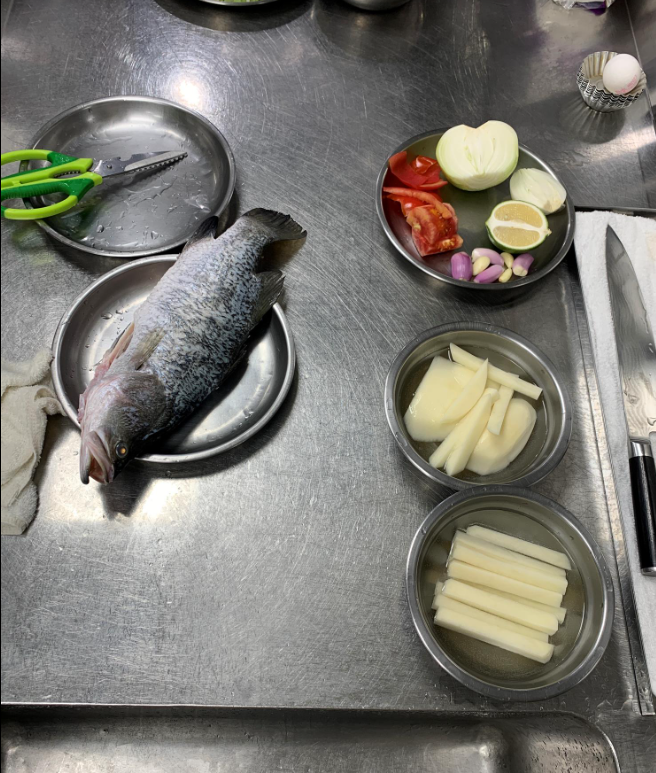
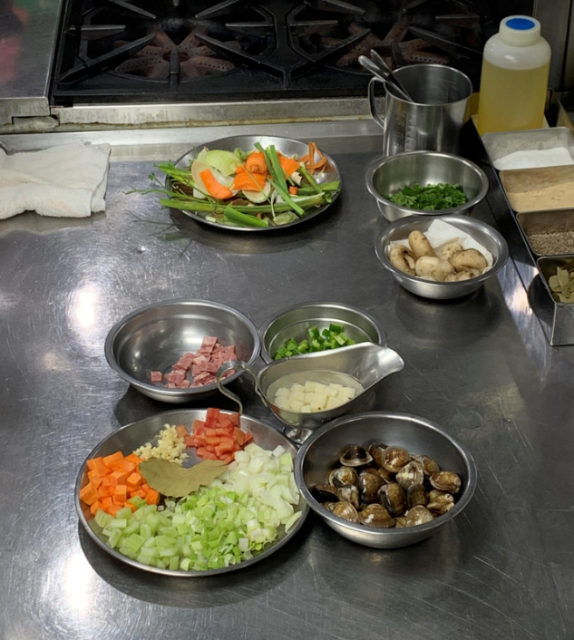

- [[632_Cook_Recipe]] 
第七堂課20220709肉桂奶酥苹果塔，奶油蘑菇鲈鱼排，曼哈顿蛤蛎巧达汤

- 
食材處理

  青椒切丁（味道重餘料不要熬湯）
  紅蘿蔔切丁
  西芹切丁
  蒜苗去內心
  番茄去蒂頭，番茄子去掉可以跟蛤蜊煮（不能跟魚湯煮），去皮
  蒜碎
  馬鈴薯切一公分厚片，切成條狀，部分切丁部分做薯泥，部分最漂亮的做魚排下面裝飾、
  巧達湯的培根切丁，可以拿鴨賞代替
- 
鱼菲力处理

  殺魚用去鱗器，上下魚鰭很尖銳，先尾巴往頭逆鱗去鱗，通常在水裡殺鱗片就不會亂噴，魚鰓拿剪刀夾住轉一轉扯斷先不拿出，從尾端排泄孔下剪刀正中剖開，往前內臟可以一路拉出一整付內臟包含魚鰓，最後拿出尾端魚膘，靠背部脊椎的部分有一些膜跟血塊黏液要洗乾淨
  魚菲力(菲力是指刀工而非部位，沒有骨頭、刺等)，鱸魚脂肪少膠質多，兩面側腹兩個侧鳍腹鳍拉起來斜切各一刀，就可以把鱼头三角形切下来，可分割为魚下巴跟鱼头，接着魚的尾巴先切平刀一刀到脊椎骨骨頭不要切斷魚頭朝兩點方向，魚背朝向自己，從脊椎骨的上緣下一刀，再切斷肋骨把第一片片下來，不要直接切斷(方便片另外一面的时候有着力点)，換成尾巴兩點鐘方向，片另外一面，片下来後也把原本没切断的第一面取下来，接着将两面片下来的鱼肉去骨修形，魚腹找肋骨，一刀刀同方向下，不要來回拉刀鱼肉会碎，可以剔除骨頭肉，背鰭的小刺小骨頭修掉，鲷鱼魚刺主要在前三分之一段，如要去皮(去皮的用煮的)，先在尾端肉的那面靠边边0.5公分处开一个口，用手拉着尾端，鱼皮朝下下刀，左右左右就可以把整片皮片起來，頭尾修一下就得到完整的魚菲力，若不去皮的魚排(拿来用煎的)，前後修一下，切成兩塊，把兩邊擠一下弓起來，間隔一公分畫皮即准备完成
  两种去皮与不去皮的鱼片腌制，魚片用鹽白胡椒跟60cc白酒腌渍，包保鮮膜放冰箱(这次约放一小时午餐时间)
  
  
- 
魚的蘑菇醬

  洋蔥碎，四大茶匙的量
  蘑菇切片
  紅蔥頭碎2大茶匙的量
- 
海鮮高湯

  蔬菜餘料，魚骨頭，白胡椒粒（顆粒）一小茶匙，白酒60cc，一片月桂葉，水大概2000～2500cc，煮滾後大概15分鐘关火(海鲜高汤不要煮久)
- 
炒湯料

  炒湯料，冷鍋冷油，小火，先炒紅蘿蔔炒透，紅蘿蔔有點熱有點起泡時下培根，培根炒到微透明下洋蔥蒜白，蔬菜不要炒黃，下西芹蒜碎，蒜頭很碎所以不要炒久容易焦，下番茄，一片月桂葉，下兩大茶匙白酒，白酒揮發下馬鈴薯
- 
蛤蜊湯

  把一半的海鲜高湯拿来做蛤蜊湯，加入番茄後煮滾，下蛤蜊盖蓋子關火燜五分鐘通常蛤蜊會開，如果沒開就再開火一下，边开边捞出去殼，蛤蜊拿出来备用，高湯加入上面炒好的汤料中，再煮20分鐘左右，紅蘿蔔馬鈴薯都熟，用叉子会透就關火
- 起鍋準備出盤，調味，加梅林醬油一小茶匙（要搖均勻），跟tabasco甩兩下少少，滾了下蔥綠殺青，蛤蜊肉下，裝盤後滴一兩滴檸檬汁  
   
  300cc雞高湯混魚高湯
- 甜點
  炒蘋果餡，蘋果四顆切成丁，葡萄乾，肉桂粉，萊姆酒，砂糖5大茶匙，奶油30g
- 5大茶匙的糖先炒出焦糖香，但千萬不要煮焦，炒到淡淡紅茶的顏色後下奶油，（如果這時候下鮮奶油就是森永牛奶糖），奶油融化後下蘋果、葡萄乾，要拌勻不然糖會沉在下面，下肉桂粉1/2小茶匙，開始讓他燉一下，葡萄乾一定要浸在裡面，不然會硬硬的，一路拌炒大概20分鐘，收到有點幾乎乾，下一大茶匙的萊姆酒，收酒揮發後加檸檬汁一瓣，再加鹽
- 做塔皮，各個內側抹奶油讓模具防沾黏，倒中筋麵粉進去讓內側沾均勻
- 麵粉過篩，糖分也過篩，拌均勻，1/8小茶匙的鹽，奶油下，拌的時候不要去揉（容易出筋），不要捏到他油亮出油，會有油耗味收縮率很高，下半顆的蛋液大概30g
- 分成一個大概30g的麵團，圓圓斜斜的下模具去按，底部最厚，不要透，把邊邊修掉，要在把塔皮捏高出杯壁一點點，收縮完後會完美低於杯壁一點點，底部插洞排氣
- 塔皮先考170度12分鐘，出來會金黃色，蘋果餡濾水後放上塔皮
- 剩下的塔皮可以加奶粉2/3大茶匙，糖分2/3大茶匙，用雙手前後搓揉的方式拌勻，撒在塔的上方，回烤5分鐘
- 煮馬鈴薯條，水加鹽滾了煮7-8分鐘，筷子可以稍微穿透即可，水濾掉，下兩塊奶油
- 煎魚，鑄鐵平底鍋，熱鍋冷油煎魚，可以拿盤子壓一下上面，看起來邊緣金黃色但其實還不夠酥，用大鐵鍋的原因，可以煎的地方溫度較低時換位置到剛剛空白的地方，持續讓她加溫，整個煎的時間大概6分鐘
- 煮馬鈴薯泥，一樣水下鹽煮滾，過篩，會很綿可以揉成團，也是可樂餅的原料，加奶油，起司分
- 帶皮的魚撈起吸水，魚皮朝下，魚片放到大概八十度的雞魚高湯中，大概六分鐘就熟了，撈起濾水擺盤在馬鈴薯條上
- 蘑菇醬，先炒菇，油稍微多一些，菇炒到乾香，洋蔥紅蔥頭下，下50g奶油，240cc剛剛魚湯的高湯（過程要記得撇浮沫），預計要煮的剩下120cc的時候再加120cc的動物小鮮奶油，再繼續煮的剩120cc時就差不多了，過程中都不加鹽，以免控制不好越煮越鹹，（煮白醬要注意旁邊儘量不要讓他焦，注意火候），用湯匙判斷稠度，要他三角形聚集到尖端往下滴差不多，開始調味鹽巴，少許白胡椒，（海鮮要鹹才會鮮，不然會腥），最後乳化加20g奶油，下一點巴西莉，這時候可以加鮭魚卵，魚子醬等等
- 
-
- 額外知識
  番茄糊買大罐分裝冷凍，不太會結凍因為水分不多
- 蛤蜊保存，吐沙的時候不要淹過蛤蜊，也不要讓他們壓在一起，放鹽水可以冷藏幾天，鹽水大概海水鹹度25-26趴
- 蘋果不要放鹽水裡，要放可以放檸檬水，如果要搞剛可以放在蜂蜜檸檬水裡面
- 巡，日本人設計的西餐刀，老師的刀
- 通霄海水鹽場可以付費150元去參觀，原來台鹽ph9.5的礦泉水是煮過的礦泉水
- 三峽鱸魚鱘龍魚鱒魚養殖場，一斤三百，溪水養的，可真空宅配
-
-
-