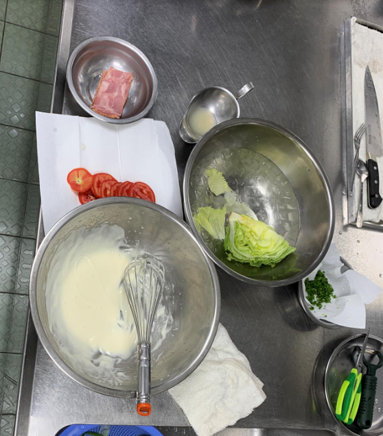
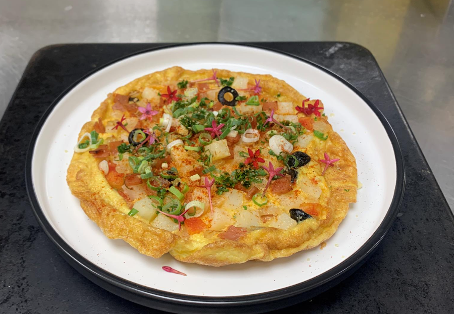
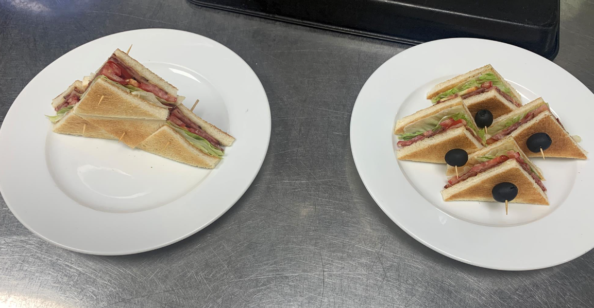
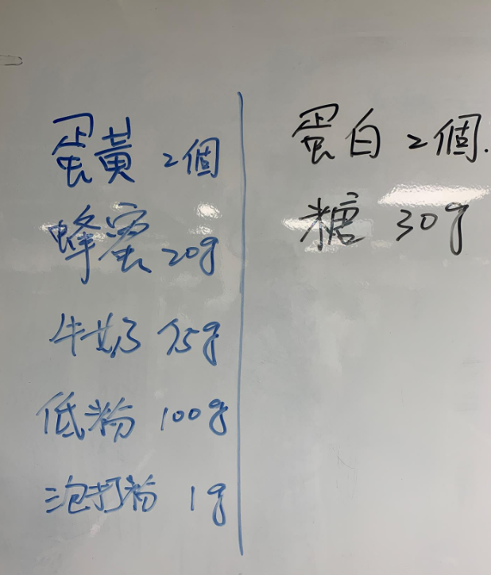
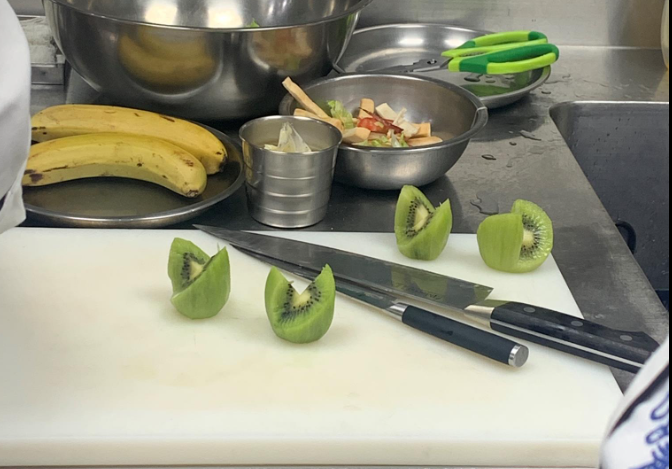

- [[632_Cook_Recipe]] 
第八堂課20220710西班牙恩立蛋，BLT三明治，美式水果松饼

- | **菜單名稱** | **BLT三明治** | **菜單名稱** | **西班牙恩立蛋** | **菜單名稱** | **美式水果松饼 ** |
  |---|---|---|---|---|---|
  | 培根 | 3片 | 洋葱丁 | 4T | 低筋面粉 | 150g  |
  | 莴苣 | 1/4ea | 马铃薯丁 | 4T | 蛋白 | 1ea  |
  | 蕃茄片 | 1ea | 火腿丁 | 2片 | 蛋黄 | 1ea  |
  | 土司 | 4片 | 蕃茄丁 | 1ea | 砂糖 | 3T  |
  | 美乃滋 | 适量 | 黑橄榄片 | 2ea | 牛奶 | 120cc  |
  |  |  | 鸡蛋 | 6ea | 泡打粉 | 1t  |
  | 美乃滋 |  | 巴西利碎 | 1t | 奶油 | 20g  |
  | 蛋黄 | 1ea | 鲜奶油 | 4T |  |   |
  | 沙拉油 | 100cc | s/p | 适量 | 奇异果 | 2ea  |
  | 砂糖 | 1/2T |  |  | 香蕉 | 1ea  |
  | 柠檬汁或白醋 |  |  |  | 覆盆子 | 50g  |
  | 盐 |  |  |  |  |   |
  | 胡椒 |  |  |  |  |   |
- 
食材准备

  食材切切切
  黑橄欖三顆切片
  檸檬半顆直接擠汁
  
  
- 
制作美乃滋

  美乃滋 一顆蛋黃，1/2大茶匙糖先打再加，一瓶蓋白酒醋，1/4小茶匙黃芥末，一點點鹽放在鋼盆裡面打打打（蛋黃裡面有卵凝酯），打到有點變白，很多空氣的感覺，慢慢分批次倒入油100cc，如果油水分離就是失敗的美乃滋，自製的保存頂多一週較佳，在家裏可以用優格代替
  打好的美乃滋，加入芥末1小茶匙，一點點，1g左右茴香（蒔蘿草），一大茶匙蜂蜜，一點檸檬汁（酸會讓食材變白）
  失敗的美乃滋，就是油水分離，通常是沒打發或者是油加太快，這樣会是一直水水像油醋的液體怎麽打都打不起来，失敗補救方法再弄一顆蛋黃跟一瓶蓋的醋，把蛋黃汁打白，這時候把上面的失敗品慢慢加進去就可以重新打發
  
  
制作恩立蛋

  馬鈴薯用冷水煮，這次的丁大小約莫水滾5分鐘
  六顆蛋加1/2小茶匙的鹽，鮮奶油3大茶匙搅拌均匀後用三角濾網過濾
  炒料，小鐵鍋燒熱，養鍋，洋蔥炒透，下火腿，炒香下番茄黑橄欖，不要炒太久番茄會散，下1/4小茶匙的鹽，起鍋後把水煮馬鈴薯加進來拌匀，料就準備好了
  开始煎蛋，養鍋很重要，沒養好很容易煎失敗，養好離火下奶油會狂噴，奶油融了下蛋液，快速拌炒，可配合抖动锅柄(不要用力刮鍋子底部) 確認底部不沾鍋，把料向下壓進半熟蛋裡面，边缘让它多累积一点蛋液体，連同鍋子烤箱烤170度6分鐘，剩一分鐘的時候上面可以下蔥花調高成180度讓表面上色，出烤箱下一點巴西莉，一點起司粉，一點點匈牙利紅椒粉
  
-
- 果醬，四大茶匙的糖冷鍋炒出焦糖，褐色起泡，下冷凍覆盆子一公斤煮，煮滾，用果汁機打細，有時間就一路熬煮到水分散失，沒空的話老師用速成的方式，熟粉玉米粉去勾芡（水3:1粉），如果不是為了當沾醬畫筆，可以加麥芽糖去勾芡
  
  
制作三明治

  培根小火煎香酥起鍋，吐司两面烤香，組裝，吐司為底，加上美乃滋，加上生菜加上番茄，上培根，頂蓋吐司上去，吐司去邊，切成四個三角形擺盤(通常做三明治生菜放下面，肉會放上面，咬下去的口感會比較好)
  
- 
制作鬆餅

  
  松饼面糊，兩顆蛋分离成蛋白蛋黃，将糖加入蛋白打發，牛奶，蜂蜜加入蛋黃中，麵粉泡打粉過篩加進去(如果不想加泡打粉也可以把蛋白打發也有一定效果)，把蛋白打到濕性發泡即可，分兩三次加入蛋黃中，用木勺拌勻
  {:height 732, :width 618}
  大的平底鍋燒熱養鍋，油下去產生油紋代表夠熱，(這邊重點要把多餘的油擦乾淨，開始小火煎鬆餅，才不會底不好看)，将面糊一湯匙由上往下滴下去，煎一段时间後表面氣泡會開始破，觀察底面煎上色後翻面，會開始膨脹，确认煎熟後起锅，在煎下一批次的面糊前要拿剛剛吸油的紙巾潤過整个铁锅，煎下一批平面才会漂亮
  擺盤，放上松饼香蕉奇異果，抹上沾醬，松饼塔上面放上一块奶油抹糖霜
  
  
  
  
奇異果切法

  削奇異果的方式先在蒂頭用刀尾畫一圈開頭，把一個尖尖的地方切掉(影响口感刺舌)，然後用刀末段削皮（儘量不要用削皮刀），正中用小刀下刀正中切下去，然後前後兩刀斜切可以做成造型切
  