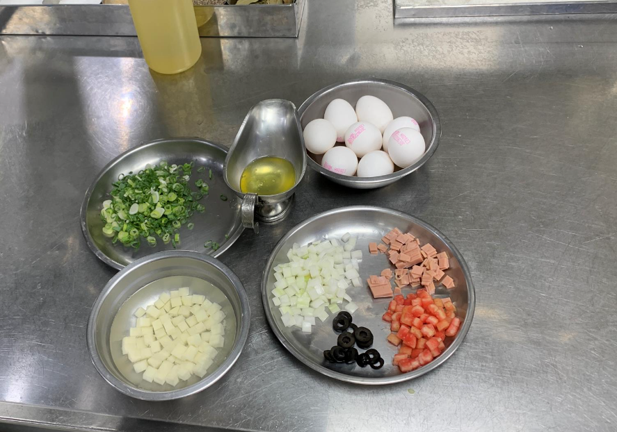

- [[632_Cook_Recipe]] 
第八堂課20220710西班牙恩立蛋，BLT三明治，美式水果松饼

  
  
食材准备

  食材切切切
  黑橄欖三顆切片
  檸檬半顆直接擠汁
   
     
  
  
  美乃滋 一顆蛋黃，1/2大茶匙糖先打再加，一瓶蓋白酒醋，1/4小茶匙黃芥末，一點點鹽放在鋼盆裡面打打打（蛋黃裡面有卵凝酯），打到有點變白，很多空氣的感覺，慢慢分批次倒入油
  100cc，如果油水分離就是失敗的美乃滋，自製的保存頂多一週較佳
- 在家裏可以用優格代替
  
  打好的美乃滋，加入芥末1小茶匙，一點點，1g左右茴香（蒔蘿草），一大茶匙蜂蜜，一點檸檬汁（酸會讓食材變白）
  
  失敗的美乃滋，就是油水分離，通常是沒打發或者是油加太快，這樣就會一直水水的像油醋的液體，失敗補救，再弄一顆蛋黃跟一瓶蓋的醋，把蛋黃汁打白，這時候把上面的失敗品慢慢加進去就可以重新打發
  
  恩立蛋
  馬鈴薯用冷水煮，這次的丁大小約莫水滾5分鐘，
  
  六顆蛋加1/2小茶匙的鹽，鮮奶油3大茶匙，用三角濾網過濾
  
  小鐵鍋燒熱，養鍋，洋蔥炒透，下火腿，炒香下番茄黑橄欖，不要炒太久番茄會散，下1/4小茶匙的鹽，起鍋水煮馬鈴薯加進來料準備好了
  
  養鍋很重要，沒養好很容易煎失敗，養好離火下奶油會狂噴，奶油融了下蛋液，簡單輕輕拌炒不要用力刮鍋子底部，確認底部不沾鍋，把料向下壓進半熟蛋裡面連同鍋子
  烤箱烤170度6分鐘，剩一分鐘的時候上面可以下蔥花調高成180度讓表面上色
  
  出烤箱下一點巴西莉，一點起司粉，一點點匈牙利紅椒粉  
  
  
  果醬，四大茶匙的糖冷鍋炒出焦糖，褐色起泡，下冷凍覆盆子一公斤煮，煮滾，用果汁機打細，
  
  
  
  有時間就一路熬煮到水分散失，沒空的話老師用速成的方式，熟粉玉米粉去勾芡（水三粉ㄧ），如果不是為了當沾醬畫筆，可以加麥芽
  
  三明治
  培根小火煎香酥起鍋，
  吐司烤香
  組裝，吐司為底，加上美乃滋，加上生菜加上番茄，上培根，頂蓋吐司上去，吐司去邊，切成四個三角形擺盤
   
  通常做三明治生菜放下面，肉會放上面，咬下去的口感會比較好
  
  
  鬆餅棉糊
  
  兩顆蛋分蛋白蛋黃
  
  糖加入蛋白打發
  
  ，牛奶，蜂蜜加入蛋黃中，麵粉泡打粉過篩加進去
  
  如果不想加泡打粉也可以把蛋白打發也有一定效果
   
  
  
  把蛋白打到濕性發泡即可，分兩三次加入蛋黃中，用木勺拌勻
  
  
  鬆餅製作
  大的平底鍋燒熱養鍋，油下去產生油紋代表夠熱，這邊重點要把多餘的油擦乾淨，開始小火煎鬆餅，才不會底不好看，一湯匙由上往下滴下去，煎一下後表面氣泡會開始破，觀察底面煎上色後翻面，會開始膨脹，煎熟後拿剛剛吸油的紙巾潤過，才可以煎下一個
  
   
  
  削奇異果的方式先在蒂頭用刀尾畫一圈開頭，把一個尖尖的地方切掉，然後用刀末段削皮（儘量不要用削皮刀），正中用小刀下刀正中切下去，然後前後兩刀斜切可以做成造型切  
  
  擺盤
  放上香蕉奇異果
  抹上沾醬
  上面放上奶油抹糖霜
- 