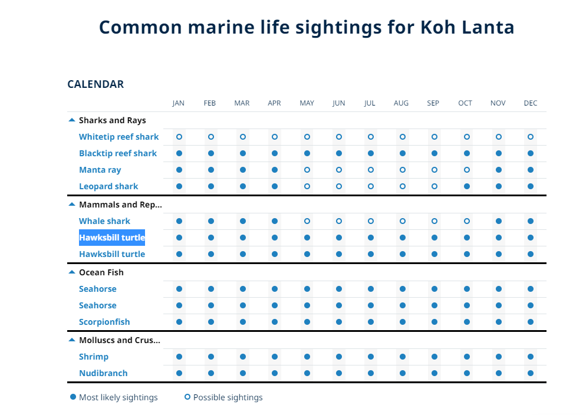
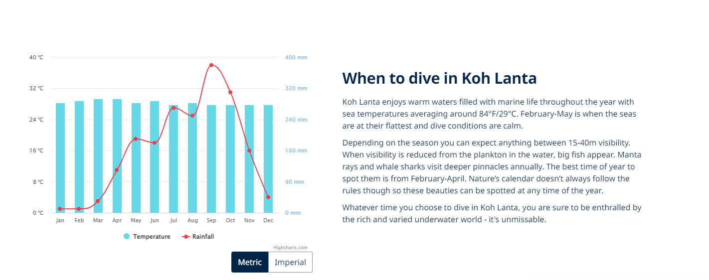

-
- [[22_Code_Skill]]
  logseq手机与电脑板同步，共用github当平台
  https://frostming.com/2022/03-20/logseq-journal-automation/
  https://github.com/yihong0618/gitblog/issues/198
-
- [[91_Job_TCG]]
  **离职信**
  萧翔文(Eric Hsiao)离职预告通知_2022/7/12
  Hi Helen,
  因为个人因素，今日2022/7/12决定辞去目前在核聚股份有限公司Project Specialist的职位，预计最後上班日为2022/7/31(生效日期2022/8/1)；过去皆与Hansen直接沟通，现在不确定目前组织架构下的对应窗口，因此先通知人资部门，烦请再行告知後续相关流程，谢谢过去一年公司及同事们的包容与指导，我會在餘下的工作日尽力協助交接工作。祝工作愉快，谢谢。
-
- [[82_Travel_Tour]]
  20220913-20220925Krabi
  
  Krabi to Lanta Ferry: At the end of 4206Road https://www.google.com.tw/maps/place/Hua+Hin+Pier/@7.6863396,99.0982013,15.95z/data=!4m5!3m4!1s0x3051fdfe7a43053d:0xac0ad3665222e27!8m2!3d7.6935801!4d99.0989062
   Koh Lanta 马蜂窝 
  https://www.mafengwo.cn/wenda/detail-16238153.html
  http://www.mafengwo.cn/i/8060589.html
  Krabi北边景点 
  ao Luk Pee Hua Toe Cave
  住宿Lan Village Homestay Krabi
  Koh Lanta Diving
  The best and most world famous dive sites are Hin Daeng and Hin Muang. They are both listed among the best dive spots in Thailand and in the world. Hin Daeng is famous for its fantastic marine life on a steep wall and Hin Muang for the superb violet coral.
  1） 甲米 雨季封岛时间：5月15 - 10月15日
  2）封的海岛有：Rok岛、Haa岛、红石紫石、翡翠洞等。
  3）小 皮皮岛 的玛雅湾最近1、2年永久封闭，什么时候开放未知。
  4） 翡翠池 的蓝池雨季也是封的！不是整个 翡翠池 都封，是翡翠城池里的蓝池会封。
  
  兰塔岛的潜点主要是三个方向：
  1）往北到皮皮岛以南，koh bida潜点群，船程2小时
  2）往西koh haa潜点群，船程1.5-2小时
  3）南部红石紫石（hin daeng, hin muang），大船3小时，快船1.5小时，也是兰塔岛的精华潜点，珊瑚生长非常好，大东西出没概率高，鲸鲨，manta，eagle ray非常多。
  在最高峰季节的12-1月，兰塔岛有的潜店会推出船宿，其他大部分时间主要是day trip，去往不同的方向的潜点，做2-3潜。
  
  
  
-
-
- #[[Words]]
  Molluscs and Crustaceans 软体动物
-
-
-
-
-
-