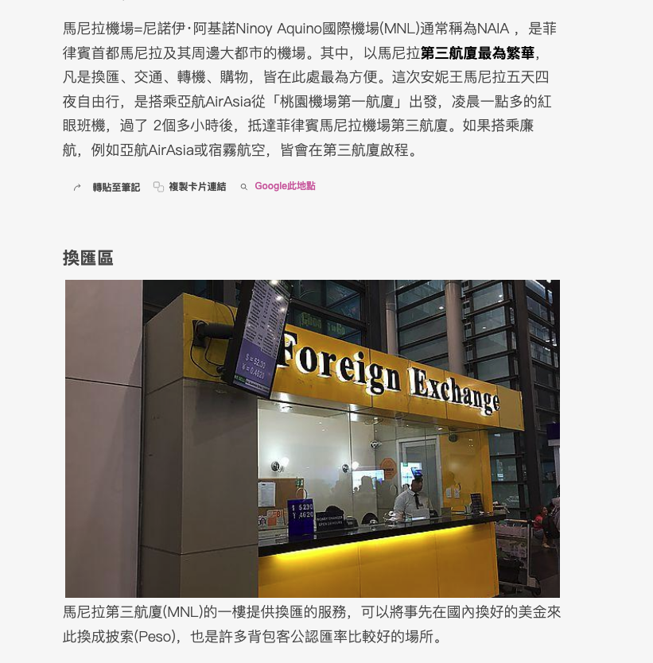

title:: 2022/9/30

- [[82_Travel_Tour]] [[83_Travel_Diving]] 
  Manila
  注意事項
  每年3-5月最热，温度最高达37℃；每年6-10月为雨季，但阵雨一般不超过20分钟。 马尼拉全年气温较高，建议携带夏季衣物，如短袖短裤。 另外凉季前往要携带御寒的外套和长裤；雨季前往要携带雨具
  轉接頭的部分，**菲律賓跟台灣的插座一樣**，不需要插頭轉換器。
   
  國家博物館 National Museum 免費週一休館
  Fort Santiago
  在古城區同一區
  如果是從馬尼拉市區前往古城區，可以搭乘LRT1到「United Nations」下車，這個站就在黎剎公園 Rizal Park旁，再一路走古城區的景點，景點間10分鐘步行都到的了。
- Taal volcano 活火山200M高
  馬尼拉南部約八十公里處，搭船上島，健行約兩小時路線
-
- 潛水
  海豚灣puerto galera 26潛點
  https://www.hellodive.com/dive/pointlist/1.html
  
  
  吃
  Mang Inasal平價燒烤連鎖
  jolibee速食連鎖
-
-
-