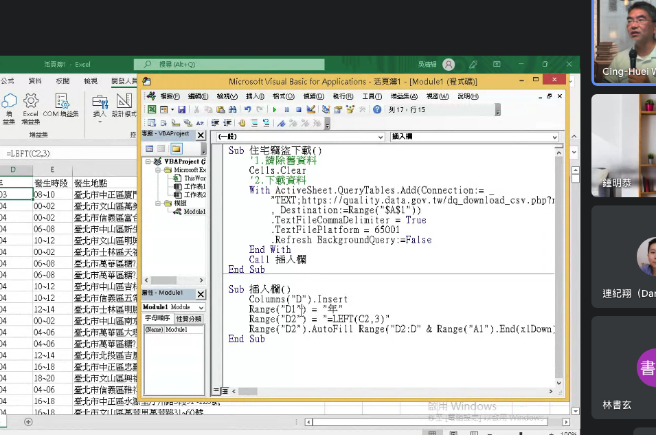

title:: 2022/10/26

- [[24_Code_Excel]]
  
  
  下載政府公開資料，關於各縣市竊盜的開源資料下載應用
  
  用VBA插入欄位
  ```
  Sub 插入欄()
      Columns("E").Insert
      Range("E1") = "縣市"
      Range("E2") = "=VLOOKUP(C2,郵遞區號,2,0)"
      Range("E2").AutoFill Range("E2:E" & Range("A1").End(xlDown).Row)
  
      Columns("J").Insert
      Range("J1") = "售電度數(當月)萬度"
      Range("J2") = "=I2/10000"
      Range("J2").AutoFill Range("J2:J" & Range("A1").End(xlDown).Row)
  End Sub
  ```
- 可以在主程式 sub 住宅竊盜() 中CALL插入欄位()的FUNCTION
  ```
  Sub 住宅竊盜()
        Cells.Clear
        blablabla....
        Call 插入欄位()
  End Sub
  Sub 插入欄位()
        blablabla....
  End Sub
  ```
  
-
-