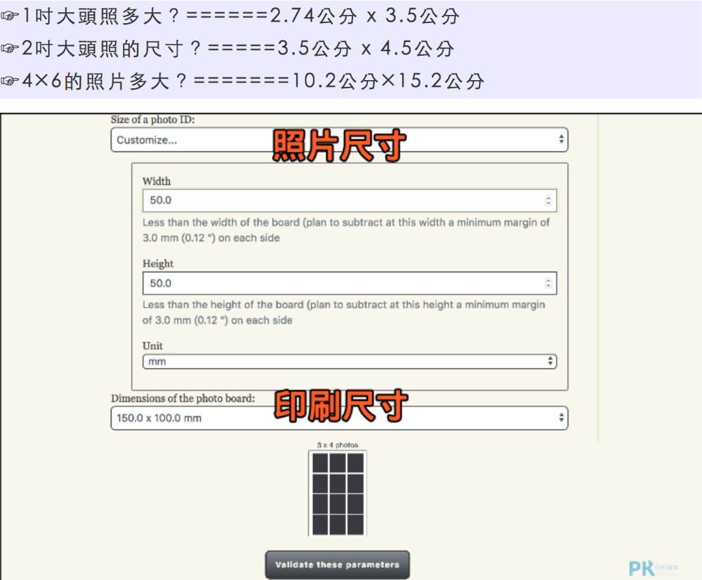

- [[22_Code_Skill]]
  vscode 快捷按键 https://dev.to/devmount/23-lesser-known-vs-code-shortcuts-as-gif-80
-
- [[82_Travel_Mountain]]
  北台湾郊山地图 TONYhttp://www.tonyhuang.idv.tw/
-
- [[82_Travel_Tour]]
  台湾温泉区域图
  |*地区*|*温泉区*|
  |台北|陽明山、金山、北投、三峽、烏來|
  |桃竹苗|北浦冷泉、爺亨、清泉、泰安|
  |台中|谷關、大坑|
  |南投|國姓、埔里、廬山、東埔|
  |台南|關子嶺|
  |高雄|寶來、不老、少年溪、多納、大岡山冷泉|
  |屏東|旭海、四重溪|
  |宜兰|礁溪、仁澤、蘇澳冷泉|
  |花莲|太魯閣、鳳林、瑞穗、玉里|
  |台东|鹿野、红叶、知本、金崙、绿岛|
-
- [[42_Home_DIY]]
  自己7-11列印大头贴https://nursemom.pixnet.net/blog/post/274825783
  {:height 650, :width 776}
-
-
- [[82_Travel_Tour]]
  懒人定房准则
	- 懶人訂房法：
	  1. tripadvisor 看該城市最好的飯店排序。勾免費網路、超值型。
	  2. 把日期輸入，會直接跳各個預定網站的價格。
	  3. 從第一名看下來，一直看到可以接受的價格。
	  4. 確認地點，選最便宜的預定網站，訂房，確認。
	  Bookings.com
	  Agoda
	  Airbnb小心標的位子偏離很多
	  Jalan (日本)日文版的iPad app很好用，可以和tripadvosors app交互輔助
	  hotels.com有中文介面，不算國外刷卡，可以省手續費
	  Priceline 和 hotwire 下標網站
- [[49_Movie]]
  齊瓦哥醫生，史詩般電影，男主角演技一流！因著這部電影，久想走9,288公里的西伯利亞大鐵路，並於去年成真！
  V怪客
  Inception
  攻敵必救
  Boyhood
  We bought a zoo.
  天生一對
  I am Sam，劇情的討論和音樂與畫面都是很棒的組合
  來自硫磺島的信
  "我們的父輩"也很感人！從德國觀點看二戰，看看德國人從對國家主義狂熱到對戰火的無奈。
  頂尖對決
  逆轉人生。 歐洲片，真的好看。
  如果這世界貓消失了，
  嗚嗚，超少見的亞洲親情片，痛哭流涕！節奏很像空氣人形，標準日本節奏。
  雲端情人！劇情畫面音樂都棒
  年少時代
  我的名字叫可汗
  八月三十一 我在奧斯陸
  春日光景 Quelques Heures de Printemps
  接觸未來 Contact
  K星異客 K-Pax
  布達佩斯大飯店 The Grand Budapest
  驚魂記 Psycho
  午夜巴黎 Midnight in Paris
  竊聽風暴 The Lives of Others (Das Leben der Anderen)
  十二怒漢 Twelve Angry Men
  異星入侵 Arrival 
  亂世佳人 Gone With the Wind
  阿拉斯加之死 Into the Wild
  paterson
  Before Midnight
  吸血鬼家庭詩篇What We Do In the Shadows
  衝出康普頓Straight Outta Compton
  百日告別Zinnia Flower（台）
  生命中最抓狂的小事Relatos Salvajes（阿根廷）
  兩天一夜Deux Jours, Une Nuit（比利時）
  進擊的鼓手Whiplash
  親愛媽咪Mommy（加拿大）
  實習男生存指南10 Minutes（韓國）
  內布拉斯加Nebraska
  她和她的小鬼們Short Term 12
  藥命俱樂部Dallas Buyers Club
  美國情緣，劇情你都猜得到，但是就是想要看下去
  讓愛傳出去，影響我很深的一部電影
  最美的安排
  Eternal Sunshine of the Spotless Mind
  回憶的餘燼,
  這部好美，看完之後連著看其他部還在想這部
  花神咖啡館
  One Day
  Her
  The Butterfly Effect
  The Pursuit of Happynes
  The Reader
  Ruby Sparks
  Lost in Translation
  新天堂樂園
  Cinema Paradiso
  Finding Forrester
  尋找新樂園 Finding Neverland
  名揚四海
  Fame 2009
  悄悄告訴她 talk to her
  雙面薇若妮卡 Double Life of Véronique
  十月的天空
  銀翼殺手
  Singing in the Rain
  模仿
  Schindler’s list辛德勒的名單
  Stop-loss止損
  Die welle惡魔教室
  Trainspotting猜火車
  She is the man足球尤物
  The Last Samurai 末代武士
  Goal!疾風禁區
  Almanya - Willkommen in Deutschland歡迎來到德國
  The king speech王者之聲
  Fight Club鬥陣俱樂部
  The proposal愛情限時簽
  Boy A心靈鐵窗
  in-time 終點戰
  Amelie艾蜜麗的異想世界
  壁花男孩
  about time
  真愛每一天
-