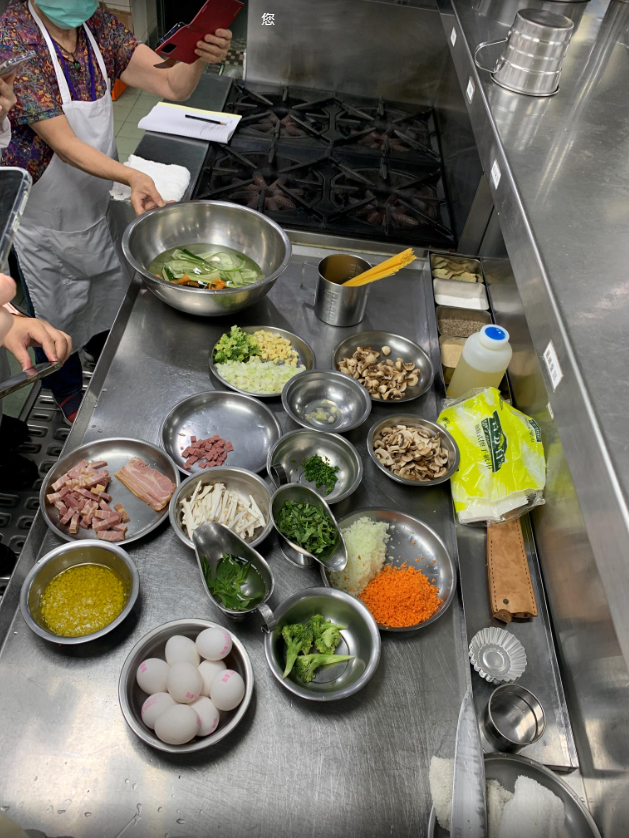
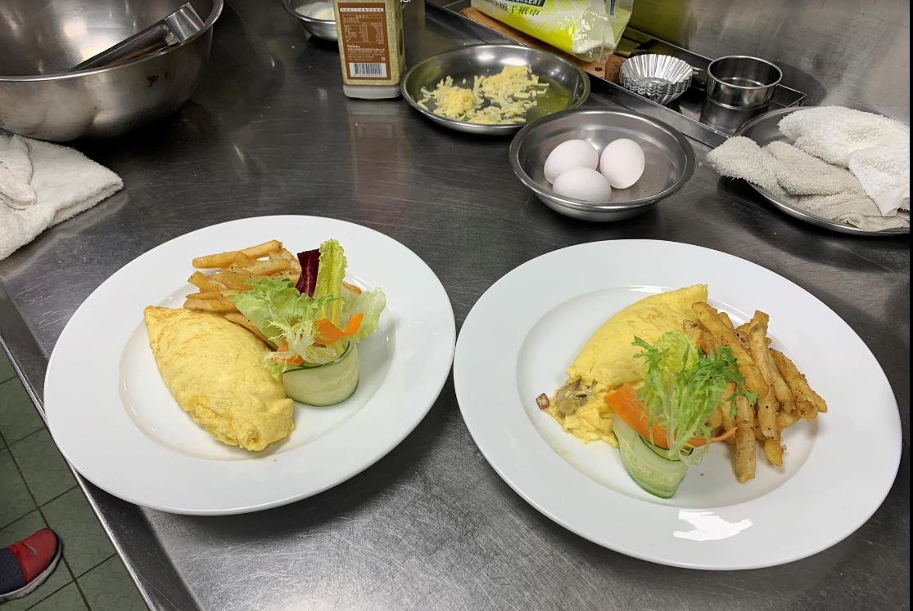

- [[632_Cook_Recipe]] 
  第二堂課20220619法式鹹派，番茄義大利麵，恩立歐姆蛋
- | **菜單名稱** | **田園培根野菇鹹派** | **菜單名稱** | **西西里番茄蔬菜義大利麵** | **菜單名稱** | **火腿起司歐姆蛋 ** |
  |---|---|---|---|---|---|
  | 培根片 | 2片 | 洋蔥碎 | 1/4ea | 蛋 | 6顆  |
  | 洋蔥碎 | 1/4ea | 蒜碎 | 15g | 起司絲 | 1/4顆  |
  | 青花椰菜 | 1/4ea | 青花椰菜 | 1/4ea | 火腿 | 2片  |
  | 蘑菇 | 1/4盒 | 蘑菇/杏鮑菇 |  | 鮮奶油 | 60cc  |
  | 杏鮑菇 | 0.5ea | 玉米筍 | 1/2盒 |  |   |
  | 起士條 | 適量 | 九層塔 | 0.25盒 | 鹽胡椒 | 適量  |
  |  |  | 聖女番茄 | 6ea |  |   |
  | 派皮 |  | 義大利麵 | 適量 | 綜合生菜 |   |
  | 奶油 | 90g | 白酒 | 適量 | 紅球萵苣 |   |
  | 中粉 | 200g | 高湯 | 適量 | 蘿蔓生菜 |   |
  | 全蛋 | 1ea | 起士粉 | 適量 | 美生菜 |   |
  | 起司粉 | 30g | S/P | 適量 |  |   |
  | 糖粉 | 20g |  |  | 蜂蜜優格醬 |   |
  | 鹽 | 5g | TOMATO SAUCE |  | 優格 |   |
  |  |  | 蕃茄碎角 |  | 蜂蜜 |   |
  | 蛋汁餡 |  | 洋蔥碎 |  | 檸檬汁 |   |
  | 鮮奶油 | 1/2cup | 蒜碎 |  |  |   |
  | 全蛋 | 2ea | 九層塔 |  | 鹽 |   |
  |  |  | 奧立岡 |  |  |   |
  |  |  | 月桂葉 |  | 带浆薯条 |   |
  |  |  | 高湯 |  |  |   |
  |  |  | 橄欖油or沙拉油 |  |  |   |
-
- 
食材处理

  洋葱完整時不要先洗，可以用刀尖剃开皮，只要撕薄薄的皮，然後头尾部份还会有些皮的颜色的组织清乾净就好，不用撕掉太多中间可以吃的部份
  
洋蔥碎
對半切後蒂頭留着不要切掉，使用刀尖或刀尾，顺纹切細條狀，留蒂头处三分之一不斷，接著橫向切三刀，最後再逆纹切，就可以切出洋蔥碎，靠近蒂头处可以从两侧圆弧形削完，最後在沾板上把它再剁碎
  
洋蔥丁
把蒂頭去掉，橫向逆纹切一公分寬平行，接著按照顺纹弧度切成丁，最後面剩兩三刀時可以把它倒下來切比較順手
  
杏鮑菇
（基本太空包所有香菇）不建議洗，洗了以後吸水用炒的就不會香，只能用紙巾擦，但如果有沙有土类型的香菇就要洗
  
杏鮑菇絲
先把它切片，然後再放成絲
  
巴西蘑菇角
十字對切就是角，柱狀可以吃，但中式香菇的柱狀物就建議拿掉太硬了影响口感，香菇柱子可以煮汤
  
蘑菇片
直接暴力切片，可以稍微厚一點，約3mm，口感較好不要太薄
  
玉米筍
玉米鬚在燒烤时是最好吃的精华，帶皮烤完撥開撒點鹽直接吃很棒
  
青花菜
一整顆的時候可以把尾端用削皮刀削一下根部
  
蒜頭
儘量不要碰到水，可以用小刀切蒂頭順便拉一點絲起來比較好撥，切完後再過一下水去掉上面的糖，可以做起來以後泡（好的苦的初榨義大利橄欖油）防止氧化，放冷藏可使用一个月
  
火腿片
切长宽1公分的正方片
  
培根片
用薄片的是橫著刀片下來，新手要小心，主要食指中指放在食材上，无名小指一定都高於水平面才部会切到，另外拿刀的拇指压刀
  
九層塔
稍微直线切几刀就好
  
小黃瓜
可以用削皮刀削薄片，要放冰水才會脆
  
-
-
- 
制作恩立蛋内馅

  大火六寸生鐵鍋平底鍋燒熱，热锅後不用下油蘑菇片乾煎至香氣，蘑菇會出水不怕，一路炒到水分減少縮回去，這時候才下油，油熱下洋蔥，用拿筆的姿勢炒到洋蔥半透明（炒洋葱比以前理解的久），加火腿丁，很薄稍微炒一下而已，至此欧姆蛋内馅料准备結束不調味
- 
制作恩立蛋沾酱

  蜂蜜，用平常喝湯的一湯匙，跟檸檬半颗，小罐的優格半罐混在一起，加一點點鹽避免死甜
- 
制作恩立蛋炒蛋

  為了讓鍋不沾需要养锅，或者说煮之前用油润锅（這種鑄鐵鍋如果溫度掉太快會沾鍋），上面那口六寸生鐵鍋燒熱，會冒煙關火後下兩湯匙油，開火燒到有煙為止，冒煙後把油倒出來再重複倒油進去到冒煙，润锅两次完成
  1.　留一點油，离火下兩塊奶油，鍋很熱所以要小心奶油噴，火關小火把一人份歐姆蛋放進鍋子，用木鏟輕輕前後左右推動，儘量不要推太用力到底部避免沾鍋，直到半凝固狀時就不要繼續攪拌儘量讓底部成形，離火下料鋪平，加起司絲，微微向自己翹起把一半包起來，確定底部脫離把它完整包好即完成
  2.　另一種版本，鍋燒熱用大火，直接大火離火下奶油狂噴，奶油化開直接下蛋液，大火攪拌，一樣離火確認半凝固下料下起司絲，蓋下來往前推，左右包進來，開小火再煎定型兩個小角
-
- 
炸薯条

  下薯條油只能装锅子一半高，當下溫度不要太高，薯條水分高，一下薯條油會往上噴满出来，薯條要炸到表皮酥起鍋吸油，可以用義式香料，鹽，黑胡椒調味
  ps自己做薯條可以用马铃薯切条，沾蛋液加低筋麵粉自制
  
-
- 
制作義大利麵醬

  使用鋼鍋冷锅冷油下洋蔥炒香，加一到兩片月桂葉（增加香氣），可以加一點剛剛泡蒜頭的油，等洋蔥變透明炒乾才下一湯匙蒜頭，不然濕濕的下蒜頭，蒜頭會吵不香，接著下紅蘿蔔稍微炒一下，接著加奧立綱origano香料，加3大茶匙白酒，等白酒揮發一下，加一大茶匙的番茄糊，加雞高湯500cc進去給他熬，會熬很久中間可以加點鹽
- 
制作法式鹹派

  奶油90g放到室溫，跟中筋麵粉200g拌勻，糖分20g也放入，鹽5g，再打一顆蛋備用，攪一下以後可以用手去捏，一開始一定很鬆散，一定要加蛋或水才會可以有效混合，加了半顆以後覺得可以揉成團就差不多可以捏成團等面团醒15分鐘，等待結束，捏成圓圓一坨，一開八滾圓，壓扁放進塔模內慢慢推薄，塔皮底部用叉子戳一排20個小凹洞以免膨胀起来，放進烤箱160度烤13分鐘，考好起來先脫模，加一點起司，加一點培根，蘑菇，洋蔥，最後上玉米筍跟青花菜，最後加上下面調的鮮奶油醬汁(鮮奶油120CC，鮮奶60CC，1/4小茶匙鹽，起司粉加入九成，剩下一成最後装盘装饰用，一點點黑胡椒，打蛋器打散)，回烤箱烤160度13分鐘完成
- 
制作燙蔬菜

  水加鹽，作用是調味並且加速川燙時間，裝飾用的平常炒菜吃的青花菜大概兩分鐘，玉米筍大概30秒到一分鐘後下碎青花菜再大概30秒就可以全部起來冰鎮，不然青花會黃
- 培根片用明火烤箱烤上色考酥脆，烤非常久才會乾酥脆(自己也不太爱这种乾瘪肉乾)
- 
制作义大利面炒料

  義大利麵跟塔皮的培根一起炒，熱鍋下油下培根，預計煎到酥酥香香的上色(比预期久，那种乾乾瘪瘪的状态)培根好了接著用培根油炒洋蔥丁，蘑菇一樣先乾炒後續可以加蒜油進來
- 
制作義大利麵条

  義大利麵條，煮滾加鹽轉開下麵，計時七分鐘（通常標準就是包裝袋少一分鐘）
  同時可以乾炒杏鮑菇跟蘑菇，下蒜油炒香，下一大踢蒜頭，加入剛剛炒好的洋蔥培根，炒香後加入剛剛燉的番茄醬汁，混合均勻後試味道（老師這裡補了鹽）開小火等麵時間到，時間到麵條放入醬汁，拌勻，（太乾可以加水或無調味高湯），下九層塔，最後再下一點蒜油
  裝盤可以用湯杓輔助，上起司粉，巴西莉，培根乾，漂亮的整片九層塔，燙過的青花菜
-
- 
额外知识点

  只有蛋白質會沾鍋，有些蔬菜可以不用非加油不可
  西餐爐前面兩口拿來炒，後面兩口燉煮用