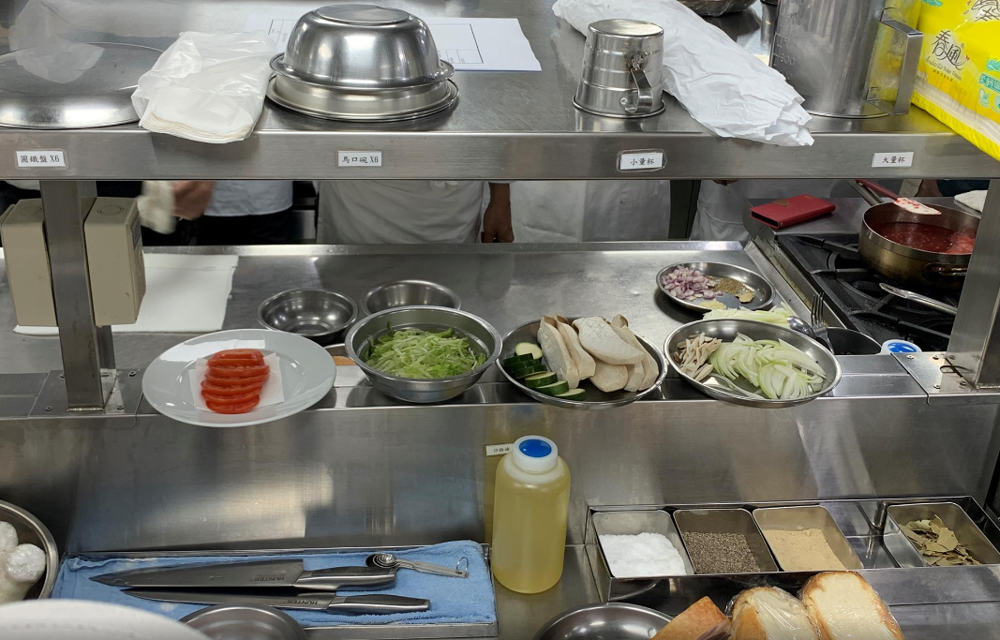

- [[632_Cook_Recipe]] 
第三堂課20220625法式洋蔥湯，法國麵包潛艇堡，法式吐司

- | **菜單名稱** | **香榭厚煎法式吐司** | **菜單名稱** | **法式洋蔥湯** | **菜單名稱** | **法國麵包潛艇堡 ** |
  |---|---|---|---|---|---|
  | 厚片土司 | 4片 | 洋蔥絲 | 2ea | 法國麵包 | 1條  |
  | 雞蛋 | 2顆 | 紅蔥頭片 | 50g | 洋蔥圈or洋蔥絲 | 1/4ea  |
  | 牛奶 | 1杯 | 蒜碎 | 15g | 廣東Aor美生菜絲 | 適量  |
  | 香草精 |  | 百里香 | 1T | 培根片 | 150g  |
  |  |  | 月桂葉 | 1ea | 杏鮑菇 | 2條  |
  |  裝飾  |  | 白酒or白蘭地 | 60cc | 起司片 | 2片  |
  | 果醬or新鮮水果 | 適量 | 褐色牛骨or雞骨高湯 | 1000cc | 牛番茄片 | 1顆  |
  | 糖粉 | 適量 | S/P | 適量 |  |   |
  | 奶油丁 | 適量 | 梅林 | 適量 |  法式蒜味美乃滋  |   |
  | 楓糖or蜂蜜 | 適量 |  |  | 美乃滋 | 4T  |
  | 薄荷葉 | 適量 | 起司麵包餅 |  | 熟蒜仁 | 30g  |
  |  |  | 起司絲 | 適量 | 法式芥未醬 | 1t  |
  |  |  | 法國麵包or吐司片 | 2片 | S/P | 適量  |
  |  |  |  |  |  |   |
  |  |  |  |  |  美乃滋  |   |
  |  |  |  |  | 蛋黃 | 1ea  |
  |  |  |  |  | 蒜味沙拉油 | 100cc  |
  |  |  |  |  | 砂糖 | 1/2T  |
  |  |  |  |  | 檸檬汁or白醋 |   |
  |  |  |  |  | S/P(盐胡椒)|   |
- 
事前准备

  法式麵包當天出爐不是最好吃的，熟成一兩天比較適合
  褐色高湯就是把食材先拿去炒了才去炖煮，可以先去掉蔬菜的腥味，炒出甜味的焦化反應，洋蔥西芹紅蘿蔔蒜苗四寶，高汤不能加有澱粉的蔬菜如马铃薯，洋蔥湯的靈魂是這鍋，三副雞骨加一顆洋蔥烤到恰恰，再丟進去煮高汤
-
- 
食材处理

  法式洋蔥湯的焗烤麵包，依照湯碗大小切片，先把麵包烤乾，再上起司條後再放进去第二次焗烤至微焦
  洋蔥汤的洋葱順紋切絲，可以吃到洋蔥絲狀口感，逆紋切在煮的过程会都化光
  紅蔥頭逆紋切片，因為纖維比較粗
  蒜頭切丁
  潛艇堡生菜 可以用廣東a生菜，羅曼取代掉，切絲不要太細会氧化太快，切完泡冰水
  潛艇堡番茄，蒂頭去掉，逆紋切成0.5公分厚，先切圓片再考慮太大是否對開
  潛艇堡洋蔥也是順紋切絲，節瓜切一公分厚度
  潛艇堡杏鮑菇切成1.5公分的片，可以頭尾先修一點，才好放，中間比較寬的那面，斜刀劃0.5公分寬的格子紋
  潛艇堡培根，三片再對半，大概一公分厚的培根，泡熱水20分鐘去鹽
- 
-
- 
制作蒜味美乃滋

  蒜味美乃滋，可以用磨蒜的板子，如果可以，早四小時先做让它味道更融合
  蒜頭帶皮，沙拉油淹過蒜頭，130度烤到透，輕輕叉子可以穿過去的程度，可以化成泥，可以拿來做法式美乃滋的蒜泥
-
- 
制作洋葱汤的汤

  洋蔥湯的炒洋蔥（兩顆半），冷鍋冷油開始炒，大火三大茶匙沙拉油炒，开始出聲音時候火轉小一點，沒聲音火又可以大一點，因為大火一直炒，可能發生焦了卻沒透，等洋蔥軟了一路上色後才下紅蔥頭(至少二十分钟)，鍋邊慢慢煮五分鐘开始锅边會產生焦焦的顏色離火把它刮下來，（刮只要刮微焦的部分，全焦的就不要刮进来了，刮不下來時可以分批慢慢加白酒60CC下去）。繼續炒可能十五分鐘，加蒜碎，繼續炒可能十分鐘會變咖啡色，最終总共炒大概40分鐘(長時間加熱不要用初榨橄欖油)，下乾燥香料百里香月桂葉進去拌炒，加半小茶匙的白胡椒跟胡椒粉，换到深锅，洋蔥湯加一大茶匙麵粉下去作為勾芡用，然後加入高湯1000cc開始煮，大概煮40分鐘，过程中间捞掉上层浮末，煮完後月桂葉，百里香從湯裡面撈起，開始調味，視情況加水稀释，（不用加糖），加鹽，白胡椒，桂林牌梅林醬1/2大茶匙，起鍋前加5CC玉山白蘭地提味，此时将洋蔥湯的法國麵包，上火烤過，加起司絲加一點點凱莉茴香，加一點起司粉，湯加到九分滿，放到汤上，上面放上起司麵包拿去上火焗烤融化即可
-
- 
制作潜艇堡的料

  潛艇堡的料，熱鍋後離火下油先炒菇，香了再下洋蔥，加點鹽黑胡椒調味，炒透不要炒上色
  潛艇堡杏鮑菇節瓜調味，鹽巴白胡椒一點點，橄欖油拌油，大概3大茶匙的油，(瓜類菇類油需要下比較多，但如果是甜椒那種就不太吃油)
  潛艇堡先煎培根，熱鍋後下油，培根要好吃，用真肉的要煎到表面恰恰，起鍋吸油
  可以用這個油繼續補油然後煎節瓜跟杏鮑菇，煎的時候可以用鐵盤壓上面讓他上色，兩面煎熟，加10g奶油，奶油煎到有點起泡，有榛果香氣時起鍋吸油
  潛艇堡沾醬，美乃滋3大茶匙，一小茶匙黃芥末蒜泥，檸檬汁約1/8瓣就好，少許鹽，少許白胡椒，少許檸檬皮
  潛艇堡麵包，蒸烤箱设定95%水分，180度烤兩分鐘，但沒這麼厲害的烤箱就只能加減噴水烤用经验判断，上下蓋都擠美乃滋，下蓋開始依序夾生菜，然後夾番茄，然後放起司，然後杏鮑菇，然後培根，然後節瓜，然後洋蔥，最後斜放上上蓋
-
- 
制作法式吐司

  三顆雞蛋配兩杯480cc牛奶，加一點點香草精，打散以後浸麵包，稍微壓過，沾好以後撈出靜置
  煎法式吐司，因為比較厚所以煎上色完以後就用烤箱让它中间透，熱鍋直到熱排斥效應，倒油潤鍋，把多餘的油倒掉，下吐司先煎漂亮的面，然後翻面，側邊也要滾邊因為也有生蛋液，烤之前上面可以放奶油，不用抹開，烤大概三分鐘，160度，好了中央會澎起來（如果沒澎代表中間吐司沒吃到蛋液，要注意中間是否也有吃到），出爐切三角形，撒糖粉放薄荷葉裝飾，比較新的摆盘方式，加裝飾果醬，薄荷葉，蜂蜜，糖分
-
- 
如果要自制果酱

  做果醬，煮莓果類，果粒對比白砂糖糖分2:1，檸檬汁起鍋前下（如果拿來畫圖還可以再加一點點鹽，一點點萊姆酒），煮果醬完全不用加水，要108度一直煮，果膠釋放去水，草莓醬最好的季節就是產季末
-
- 
额外知识点

  培根是豬腹肉，火腿是後腿肉