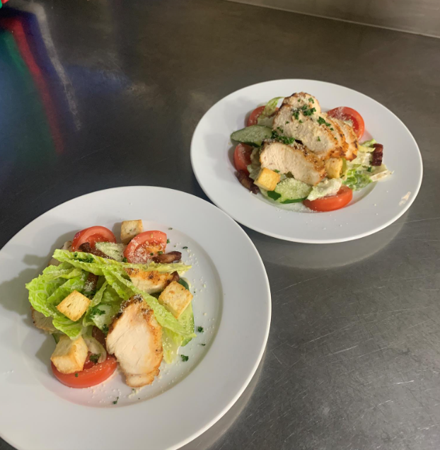
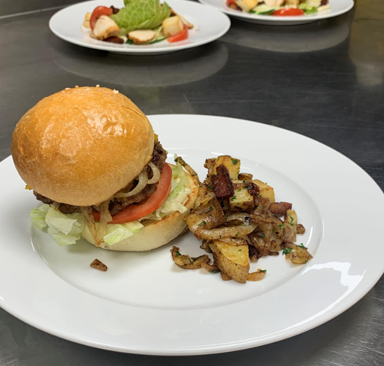

- [[632_Cook_Recipe]] 
第四堂課20220626牛肉漢堡，蘑菇浓汤，凯萨沙拉

- | **菜單名稱** | **手作牛肉漢堡** | **菜單名稱** | **卡布奇諾蘑菇湯** | **菜單名稱** | **凱蕯雞肉翠綠沙拉 ** |
  |---|---|---|---|---|---|
  | 牛絞肉 | 210g | 洋菇 | 100g | 美生菜 | 60g  |
  | 豬絞肉 | 90g | 杏鮑菇 | 3條 | 蘿蔓生菜 | 60g  |
  | 洋蔥碎 | 1/2ea | 乾香菇 | 20g | 小黃瓜 | 1條  |
  | 新鮮吐司粉 | 1ea | 洋蔥碎 | 1/4ea | 蕃茄 |   |
  | 牛奶 |  | 蒜碎 | 1/2T | 熟雞胸肉 | 1片  |
  | S/P | 適量 | 百里香 | 1/2t | 培根 |   |
  |  |  | 月桂葉 | 1ea | 麵包丁 |   |
  | 漢堡麵包 |  | 高湯 | 1000cc | 起司粉 |   |
  | 水or鮮奶 | 120g | 馬鈴薯 | 1/2顆 |  |   |
  | 高粉 | 300g | S/P | 適量 | 凱蕯沙拉醬 |   |
  | 即溶酵母 | 6g | 鮮奶油 | 適量 | 美乃滋 | 120g  |
  | 砂糖 | 30g | 吐司丁 | 適量 | 法式芥茉醬 | 1g  |
  | 鹽 | 4.5g | 巴西里 |  | 梅林辣醬油 | 2g  |
  | 全蛋 | 1ea | 西芹 |  | 起司粉 | 3g  |
  | 奶油 | 40g | 培根 |  | 檸檬汁 | 7g  |
  |  |  |  |  | 鯷魚 | 15g  |
  | 漢堡配料 |  |  |  | 酸豆 | 5g  |
  | 牛番茄片 | 4片 |  |  | Tabasco香蒜辣椒汁 | 2g  |
  | 炒洋蔥絲 | 1顆 |  |  | 蒜碎 | 15g  |
- 
事前准备

  蘑菇湯的乾香菇泡熱水（用牛肝菌菇也可以取代），軟了用剪刀切掉蒂頭，切片
  沙拉生菜泡冰塊水备用
  巴西蘑菇有土要洗，切0.3公分厚片
  杏鮑菇就儘量不要洗，一開四，切丁就好，後續炒完會用果汁機打成濃湯，所以刀工只要不要太大塊就好
  洋蔥湯的半顆切洋蔥碎，另外漢堡肉半顆也切洋蔥碎，剩下一顆夹汉堡的洋蔥逆紋切絲，宽一點約0.4公分寬，會比較不辛辣
  蘑菇湯蒜頭一顆切蒜碎
  蘑菇湯西芹，大概兩食指長就好，切碎，因為會果汁機打所以不用去皮，如果是吃沙拉就要去皮口感较好
  馬鈴薯切塊，泡水
  沙拉跟湯的培根兩三片食指長，約切像叉烧店的燒肉的塊狀
  沙拉的烤雞胸，把脂肪跟白色組織修掉，灑上迷迭香，匈牙利紅椒粉，黑胡椒，鹽1/4小茶匙，糖一大茶匙（這樣才會嫩），沙拉油，抓醃
  牛絞肉3:豬肉1這樣絞肉，豬肉的油酯比較多，豬肉的肥瘦比大概3:7，這是老師这次的配方，絞肉买回來一定要自己再剁一剁，老師大概來回剁了五次
  漢堡番茄一顆逆紋厚片，半顆沙拉的番茄開八瓣
  巴西莉，梗不要，只要葉子，切碎，裝飾用
  沙拉小黃瓜削三條皮增加適口性，切斜片
- 吐司一片給濃湯去邊切丁，一片切丁給沙拉，切一顆蒜碎，奶油兩塊大概10g，一點巴西莉末，鹽適量拌進去，放烤箱烤
-
- 
制作汉堡面团

  漢堡麵包面团制作，酵母6克，15克糖，此时千萬不要加鹽，酵母会死，加牛奶150克，等他發酵大概半小時，如果要快一點可以把牛奶加熱，大概發了30分鐘，把酵母跟15克糖加進麵粉，加一顆雞蛋，用叉子攪拌，手開始抓有點絲狀有點濕潤度，這時再加4.5g鹽，太乾可以加一點水补一下，先揉成團，奶油回室溫才能揉進去，
  麵團大概會發到兩倍大，戳了不會回彈大概就差不多。一開四，往內搓揉包圆，拍打紧实，放到烤盤間距要抓，封保鮮膜讓她再發酵，大概又過20分鐘，打一顆雞蛋，上方抹上蛋液，撒一點生白芝麻，180度，烤20分鐘
-
- 
凯萨沙拉制作

  凱撒沙拉，(凱撒概念三寶麵包丁，起司粉，培根)，熱鍋相當熱以後下油關火下雞肉，開火把表面煎上色，表面微微碳香微焦，放烤箱烤，160度12分鐘
  培根小火煎，煎到酥脆，大概至少煎了15分鐘
  凱撒沙拉醬，酸辣鹹缺一不可，酸檸檬，辣蒜頭跟tabasco，提魚跟鹽鹹，蒜碎切細，酸豆切碎，鯷魚剁細，放到美乃滋中，Tabasco1克，梅林醬2公克，法式黃芥末醬1匙，檸檬汁八分之一瓣，三公克起司粉
  凱撒裝盤
  1.擺盤先抹美乃滋在底部，美生菜擦乾立在上面，側邊擺小黃瓜番茄
  2.另一種現拌，先把所有美生菜都手撥放進鋼盆加凱薩醬進去用夾子拌，上面生菜完成後，放上培根跟麵包丁，斜切的烤好雞肉，最後撒上起司粉
  
-
- 
制作汉堡肉排

  熱鍋炒香洋蔥丁，加到牛絞肉，原因是希望有洋蔥香但不要水分以免肉排的空洞，吵到稍微變色大概八分鐘吧，降溫後加入牛絞肉中，吐司丁也加入(漢堡的吐司丁加80克鮮奶)，黑胡椒些許，鹽些許，義大利綜合香料，用手揉均勻，摔打他讓他更緊實，最後一開四分成四坨汉堡肉，煎漢堡肉，鍋熱潤鍋，下鍋前儘量壓扁，下锅後受熱會收縮，翻面煎熟，中間不要壓以防他散掉，中心溫度有75度代表全熟，或用叉子叉一下沒有血水跑出也是判斷方式，起鍋前放上起司片撈起
-
- 
制作蘑菇浓汤

  蘑菇湯開始煮，先下蘑菇乾炒不要加油，炒香後加一大踢的油炒杏鮑菇，接著再下香菇，吵到水份有點收乾，加洋蔥，百里香一絲絲，一塊奶油，加蒜碎跟西芹碎，兩大茶匙白酒，炒到沒酒味，加500CC雞高湯，煮大概20分鐘，放微凉後放入果汁機打，一開始不要放太多會噴，太濃稠也會噴，太濃可以加高湯調整，大概要打五分鐘，起來後加120CC鮮奶油，調味，再次炒一下裝飾配料香菇小火煎上色，蘑菇湯裝盤，放上裝飾香菇，培根，巴西利，一點點橄欖油淋上面
-
- 
组装汉堡

  漢堡皮抹酱，美乃滋加上1/10的黃芥末放到塑膠袋裡面角落擠好備用，美生菜切絲準備好
  漢堡的洋蔥也可以炒，要炒大概15分鐘炒到像是洋蔥湯的洋蔥大概浅咖啡色的狀態
  麵包烤起來把切開麵包抹奶油，再煎一下中間抹奶油那面煎上色微焦，擠上美乃滋，生菜絲，番茄放上，肉排起司放上，洋蔥上蓋，牙籤固定
  附餐的帶皮馬鈴薯切塊，加紅椒粉，培根油或者沙拉油，黑胡椒，可以跟鸡肉一起烤(放烤箱烤，160度12分鐘)，烤出來的馬鈴薯丁，剩下的洋蔥，培根，鹽胡椒，一點義式香料，煎到馬鈴薯上色
  