- [[22_Code_Skill]]
  https://www.jianshu.com/p/36342812cd3a
  git command material
  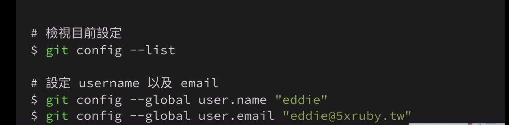{:height 32, :width 247}
  建立資料夾 ＝建立目錄
  pwd 查詢目前資料夾位置
  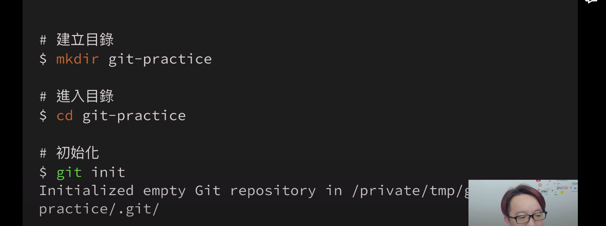
  用ls -al可以查詢檔案存在與否
  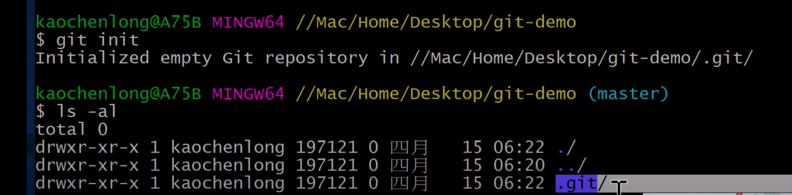{:height 183, :width 707}
  原本東西都放在本地的工作目
  git add index.html --> 將index.html放到暫存區
  git status 可以查詢目前狀態 add 完以後就變成new files 放到暫存區
  git commit -m "add index" -->commit 加上註記備註，放到本地的repository
  git push
  git log可以看commit紀錄，了解版本紀錄
  git log --one line可以看commit紀錄精簡版
  ls -al 可以查看目前資料夾內檔案狀況
  rm *.html 刪除資料夾內所有html檔案
  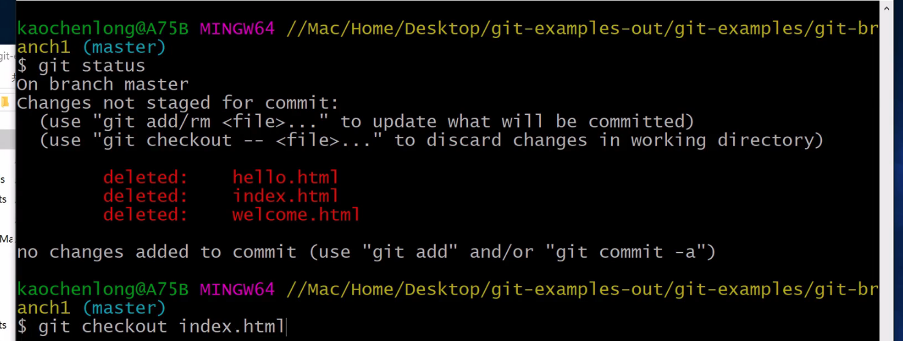
  git check out index.html 可以在commit前把檔案救回來
  git checkout .  把這資料夾裡面的東西都救回來 .git/從這個版控裡面找回來
  git blame index.html 可以查看index.html 每一行code 是誰寫的
  mkdir hello-world建立資料夾
  建立完後打git status 看不見建立出來的hello-world資料夾，因為git 是用檔案內容做計算的，但空的資料夾是空的，git讀取不到
  如果真的想要將那個空資料夾呈現在git 中
  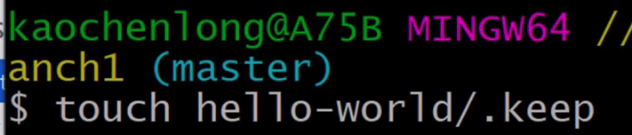
  touch hello-world/ .keep 代表如果hello-world存在，就去戳一下改變時間戳記，如果不存在就去產生
  通常在作業系統裡面 .keep這種檔案代表隱藏檔，不一定有用但平常也不用看到就可以這樣操作
  git的世界commit才是本體，分支只是標籤浮雲
  git branch 可以看到分支
  git branch cat 創造一個cat的分支
  git checkout cat 切換分支到cat分支，head標籤移動
  git checkout master 切換回主線分支
  git merge cat 將cat 分支合併進去（如果是一直線的那種分支，則master會fast-forward到跟cat相同的commit）
  git branch -d cat 刪除cat分支（把標籤貼紙撕起來）
  
  rebase 換根基
  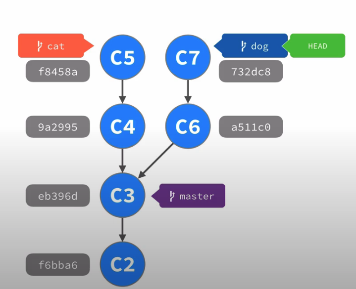
  
  git rebase cat 把dog分支換base到cat的一系列系統操作
  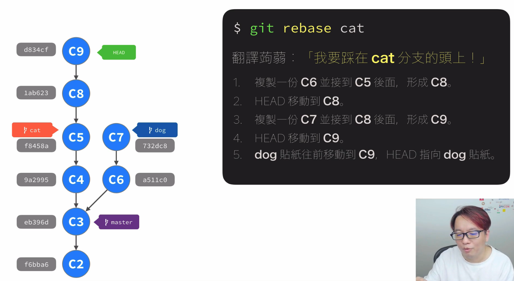
  最後C6 C7會在系統裡面被淡化，看不見，沒有真實的刪除COMMIT
  
  rebase合併以後比較適合過多節點的分支，比較乾淨簡潔
  如果用merge的那種分支可以看出Ｙ型的脈絡
  
  reset指令 比較像是become的概念
  git 的世界裡面 沒有刪除commit的指令！！
  git reset 9a2995的時候可以回到那個版本，末端枝節的版本就會暫時淡化看不見
  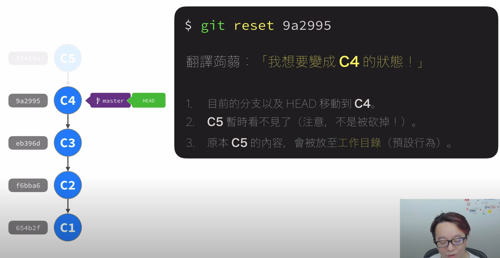
  
  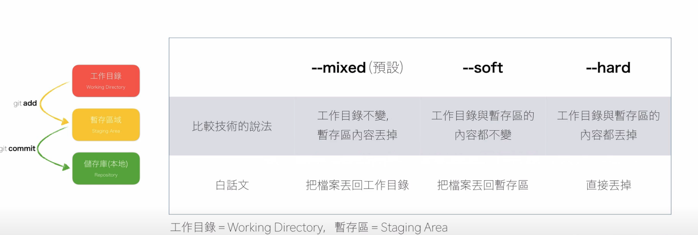
  git reset 9a2995 --hard 從c5 要退回c4
  此時C5分支會被隱藏起來，但實際上沒有真的不見
  reflog = reference log -->可以用這個方式找到C5的分支
  git reflog
  git reset f8458a --hard 回到C5分支
  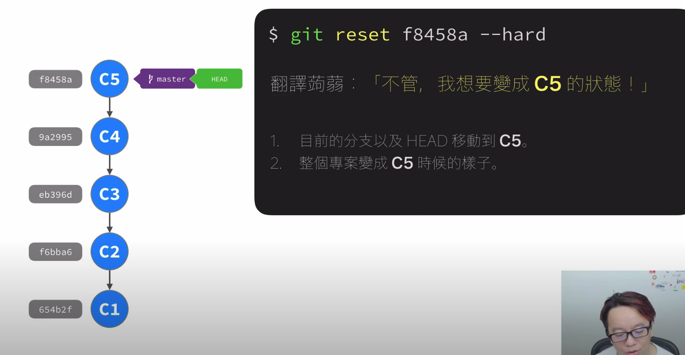
  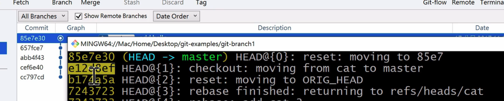
  這邊如果剛剛reset一個分支a7，回到a6，但頁面上又看不到a7了想reset回a7，用reflog可以找到e12d8ef
  
  以上講的是絕對定位
  下面是相對定位^
    = caret~
    = talde
  git reset f8458a^ 回到他的上一個狀態
  git reset head~2 我要倒回head標籤之前兩個的版本
  git reset head^ 回到目前標籤的上一個狀態
  
  reset 跟checkout的差異
  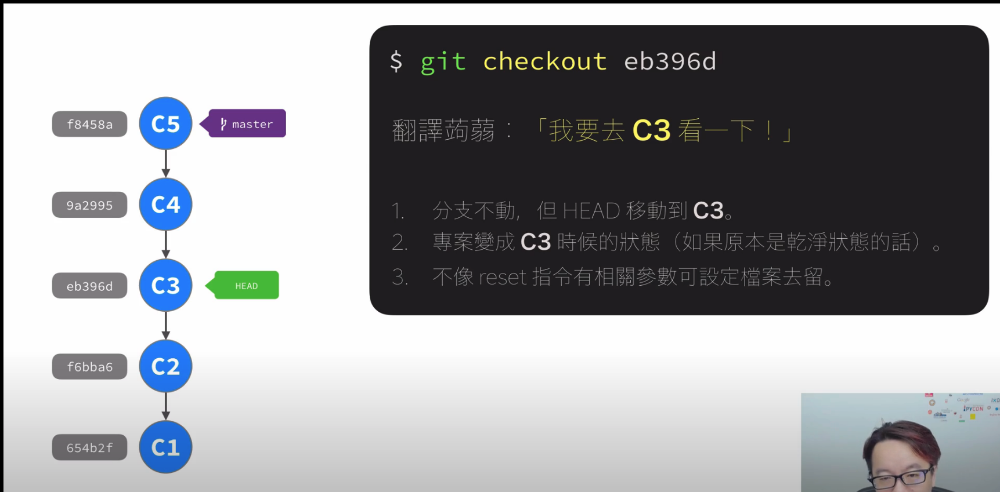
  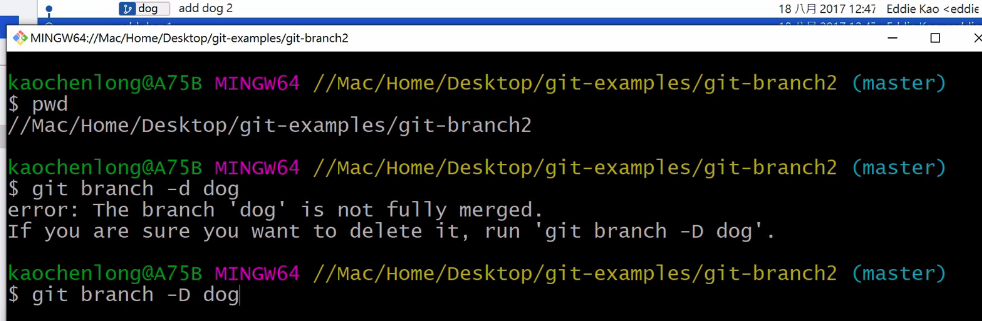
  有跳提示的時候代表有末端分支沒處理，刪除要改用-D
  git branch newnew_dog 053fb21  如果我們有之前的分支代號，也可以創建新分支到當初的那隻分支狀態，只要能找到分支代號，就一定可以把砍掉被隱藏起來的未合併分支救回來(分支代號都可以用reflog找到)
  
  cherry pick 用來挑選某個commit加進來而不merge整個分支，舉例如果想要把dolphin 加入dog合併
  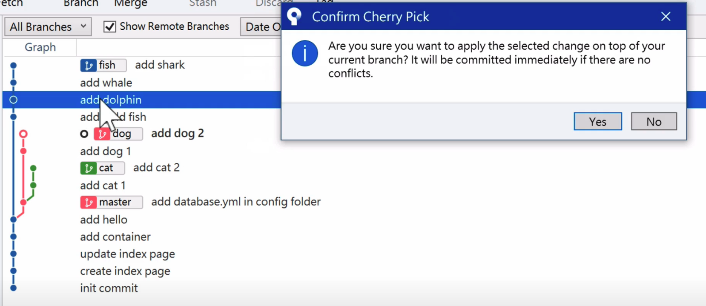
  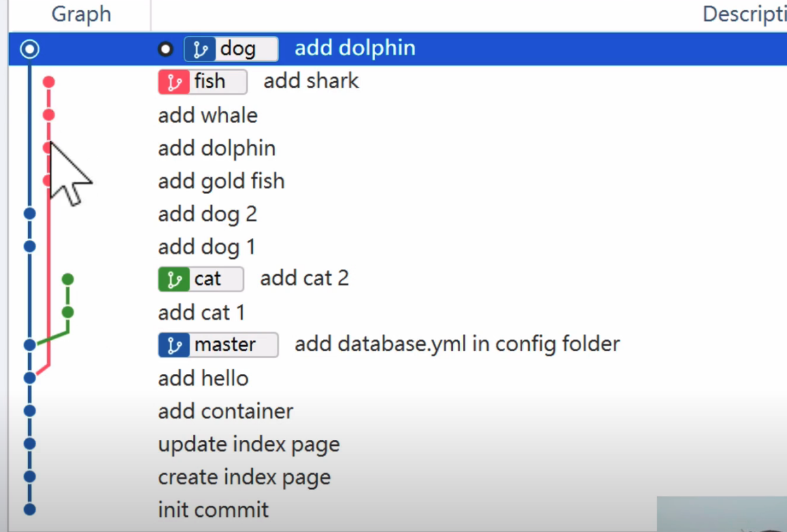{:height 529, :width 791}
-
-
-
-
- [[24_Code_Excel]]
  **excel下方空格填满**
  https://isvincent.pixnet.net/blog/post/38866753-excel-%E5%90%91%E4%B8%8B%E5%A1%AB%E6%BB%BF%E7%A9%BA%E7%99%BD%E5%84%B2%E5%AD%98%E6%A0%BC
-
-
- [[24_Code_Excel]]
  **excel反向vlookup**
  https://club.excelhome.net/thread-851761-1-1.html
  IF({1,0},C:C,A:A)的意含 https://read01.com/zh-tw/kzJdRaP.html#.Yp70H3ZBxhE
  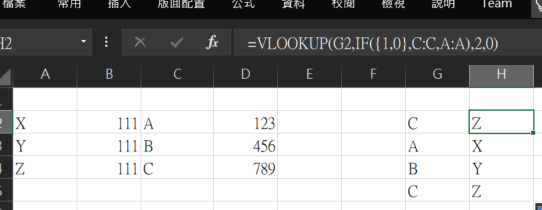
-
-