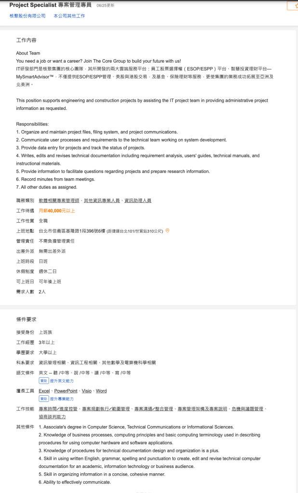

- 
- DBA JD
  ● Maintain database infrastructure to ensure high availability for company utilization.
  ● Work with other team members on current database structure and application interfaces.
  ● Recommend and maintain policies for updates and security of database services and equipment.
  ● Assist in application deployment of new features that involve database-related changes.
  ● Setup and maintain testing and development databases as necessary.
  ● Determine and maintain patches necessary for the database environments.
  ● Identify and remove bad/outdated/unused data from the company databases, archiving as necessary.
  ● Periodically update database support data.
  ● Explore, evaluate and recommend database technologies and techniques to support the business requirements.
  ● Implement automatic monitoring and problem detection.
  ● Design and implement database disaster recovery.